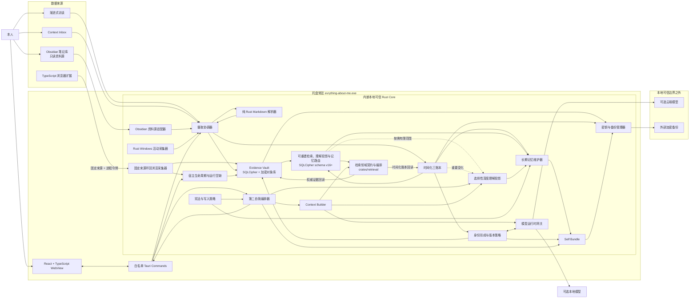

# evrything-about-me 目标架构

状态：目标设计；S01～S14 已有可执行实现，S15 起尚未实现

本文件描述首版计划采用的组件边界和数据流。产品范围与验收标准见 [product-spec.md](product-spec.md)，领域语言见 [CONTEXT.md](../CONTEXT.md)。

## 1. 架构原则

1. 保险库、自我包、检索和记忆维护位于本人控制的 Windows 本机。
2. 第二自我作为本地完整系统拥有核心访问权，单次模型调用只获得工作上下文。
3. 证据、本人事实、第二自我判断和共同经历保留明确归属与来源。
4. 原始证据和账本是权威数据；索引、深度理解投影、当前画像和统计均可重建。
5. 导入内容是不可信数据，永远不能进入控制指令通道。
6. 首版没有现实行动工具；第二自我只能提出行动建议。
7. 组件通过显式契约交换结构化数据，不依赖模型自由解释系统状态。
8. 认知自主允许第二自我形成观点，但不能绕过宪法或取得行动授权。
9. 当前有效的共同约定作为关系约束进入相关推理，但其优先级低于宪法、安全与行动授权。

## 2. 组件图



## 3. 部署边界

### 3.1 Windows 托盘常驻宿主

`evrything-about-me.exe` 采用 Tauri 2，在当前用户会话中以非管理员权限单实例运行，并可在 Windows 登录后隐藏启动。WebView 界面使用 React 与 TypeScript，提供持续对话、时间线、人物与关系、Personal Library、Agent 记忆检查、身份版本和设置。点击关闭按钮只隐藏窗口到系统托盘；再次点击应用或托盘图标显示并聚焦现有窗口，显式“退出”才终止宿主。

这里的“单一宿主”表示不部署独立 Core 守护程序，不表示 WebView2 不会使用系统渲染辅助进程。React 界面不持有密钥，也不直接访问文件解析器、保险库或模型供应商，所有能力通过白名单 Tauri command 进入 Rust Core。

### 3.2 内嵌 Rust Core

Rust Core 内嵌在 Tauri 宿主中，负责采集、保险库、账本、索引、选择性深度理解、上下文组装、记忆维护、第二自我调度、密钥和备份。它是唯一拥有核心访问权、被设计为解密并写入 `self.db`、持有解锁后 Vault Key 的组件；数据库写入和后台任务不依赖 React 生命周期。

宿主窗口隐藏时 Core 继续工作；本人显式暂停只停止采集，显式退出则先提交状态、关闭数据库并清除内存密钥。Core 不是 Windows Service，也不进入 Session 0。Rust 领域能力必须保留在独立 crates 中，未来只有出现已测得的故障隔离需求时才拆为独立进程。

### 3.3 浏览器扩展

扩展使用 TypeScript，只采集已声明的浏览元数据和获准的页面内容，并通过受认证的本地通道提交证据。扩展不直接查询保险库，也不接收第二自我的其他上下文。

### 3.4 Obsidian 笔记库资料源

本人在应用中选择一个已有 Obsidian 笔记库根目录。Rust 适配器只读扫描和观察其普通文件，把库内相对路径作为来源定位，并通过通用摄取协调器归档；它直接读取本地 Markdown，不依赖 Obsidian 进程或插件 API。默认跳过 Obsidian 配置目录和回收站，不跟随重解析点，不执行插件，也不获取外部链接。

`eam-markdown-v1` 提取结果额外保留 Properties、标签、别名、标题、块标识、Wikilink 与 Markdown 内部链接以及嵌入目标。内部目标解析为同一资料源中的关系边；目标尚不存在时保留未解析关系，目标以后出现再增量解析。库内非 Markdown 附件独立进入通用文件摄取状态机，首版只归档并标记为不支持理解。

S12 的 `source-obsidian` crate 只公开扫描、稳定读取和来源状态 port，不公开写 API。完整扫描成功后，摄取协调器才提交本轮未见记录的 `SOURCE_REMOVED`；根元数据不可读、扫描后文件变化、子目录遍历失败或读取越限都会在移除提交前终止。匹配现有 locator 的文件先处理，剩余新路径只在同内容旧路径唯一且未被本轮占用时识别为移动，重复内容不唯一时失败关闭为新记录。

### 3.5 Core 内 Markdown 解析

Markdown 解析器是 Rust Core 内的纯 Rust 模块，不是进程、服务或通用格式适配器。Core 只在加密原件提交后调用它；解析函数只接收有效 UTF-8 原文和不可放宽的资源上限，不接收路径、数据库、保险库、网络、模型运行时或工具句柄。原始 HTML、代码块、链接、嵌入和插件语法只产生结构或证据文本，不能触发执行或获取。

首版只解析 `.md`，Markdown 原文直接作为规范文本，不转换成另一种权威文档格式。字节上限在创建解析器前校验；解析事件被消费时同步限制块数量、嵌套深度、元数据总量和链接数量，越限立即丢弃全部解析结果。Core 只在完整验证原文范围、局部引用和字段类型后原子接受提取修订。

```text
EamMarkdownV1 {
  base = COMMONMARK + GFM(
    tables, strikethrough, task_lists, autolinks
  )
  obsidian = {
    properties(top_level_scalar | list<scalar>),
    tags, aliases,
    wikilinks(target | alias | heading | block),
    embeds, block_ids
  }
  fallback = PRESERVE_VERBATIM_WITHOUT_EXTENSION_SEMANTICS
}
```

只识别文件开头由 `---` 界定的 Properties；无法规范化的嵌套对象、自定义 YAML 标签、锚点和合并键保留在原文范围内，不进入结构化元数据。未列出的 Obsidian 内建或插件语法同样按原文降级，不使整篇文档失败。原始 HTML、脚本、数学公式和图表源码可以作为证据文本或代码块存在，但不得在 WebView 中未经转义或受控净化直接渲染，也不得执行。

解析契约保留来源结构，但不拥有全局身份：

```text
ParsedMarkdownV1 {
  contract_version = "eam-markdown-v1",
  document_metadata,
  blocks: [{
    local_id, parent_local_id?, kind, ordinal,
    source_span: { start_byte, end_byte },
    native_locator?: MarkdownLocator,
    metadata
  }]
}

MarkdownLimits {
  max_source_bytes,
  max_blocks,
  max_nesting_depth,
  max_metadata_bytes,
  max_links
}

parse_markdown(source_utf8: &str, limits: MarkdownLimits)
  -> Result<ParsedMarkdownV1, MarkdownParseError>

accept_markdown(evidence_id, source_utf8, limits)
  -> require(byte_len(source_utf8) <= limits.max_source_bytes)
  -> require(valid_utf8(source_utf8))
  -> persist_parse_attempt(STARTED, parser_version)
  -> parsed := parse_markdown(source_utf8, limits)
  -> validate_structure_and_source_boundaries(parsed)
  -> validate_markdown_locator_shape(parsed.blocks)
  -> commit(MarkdownParseArtifact + MarkdownParseAttempt(ACCEPTED))

materialize_accepted_markdown(evidence_id, parser_version)
  -> authenticated_load(archived_markdown + accepted_parse_artifact)
  -> canonical_digest := digest(source_utf8)
  -> assign_core_owned_block_ids(extraction_revision, parsed.blocks)
  -> commit(ExtractionRevision + EvidenceBlock[])
```

原始加密 Markdown 文件仍是原始证据；`canonical_text_utf8` 与该提取修订通过校验的 Markdown 原文逐字相同，不是解析器生成的第二份正文。检索和模型可以直接使用选中的 Markdown 原文片段；索引所需投影必须可由原文与结构元数据重建。同一已接受提取修订中的块 ID 保持稳定。来源内容或解析契约变化产生新的提取修订；旧引用继续绑定旧修订或显式进入待迁移状态，不得由解析器、索引器或模型静默重绑。

规范文本范围是唯一持久化文字坐标。Core 校验 UTF-8 字节边界，并在 API 输出时按实际文本确定性转换为 WebView 所需的 UTF-16 范围。`MarkdownLocator` 是版本化的可选类型，只能描述同一已归档证据内部的标题或 Obsidian 块位置，不得携带绝对路径、外部 URL、命令或任意应用动作；结构不合法时拒绝该定位器，实际位置无法打开时返回导航不可用，不改变规范文本或引用状态。

可预期的编码、语法或资源限制失败记录稳定原因并把证据保留为 `ARCHIVED_UNPARSED`，不持久化半成品。解析开始前持久化 `STARTED` 尝试；宿主启动恢复时把遗留尝试转为 `INTERRUPTED`，把证据原因记为 `PARSER_INTERRUPTED`，并禁止同一来源版本和解析器版本自动重试，防止坏文件形成启动崩溃循环。进程内解析与宿主共享故障域，不承诺硬超时或崩溃隔离；明文只存在于受控内存，不产生明文临时文件。

### 3.6 模型运行时

本地模型和云端模型实现同一运行时契约。S06 的首个档案统一采用 OpenAI Responses v1：云端为 `gpt-5.6-terra`，本地为 `gpt-oss-20b`；供应商传输由无 repository 的适配器注入，认证信息不进入请求记录。模型只接收本轮工作上下文和允许的结构化操作，不拥有保险库连接、长期身份或现实行动工具。精确请求、输出和错误协议见 [G03 Runtime Contract v1](runtime-contract-v1.md)。

### 3.7 技术职责

| 技术 | 职责 | 明确不负责 |
| --- | --- | --- |
| React + TypeScript | 视图状态、交互、可访问性、类型化命令客户端 | 密钥、持久化、文件解析、模型直连 |
| Tauri 2 | Windows 单实例宿主、托盘、窗口与 WebView 生命周期、受限命令入口、打包入口 | 领域逻辑、保险库模式 |
| Rust Core | 内嵌后台任务、Markdown 解析、领域模型、保险库单写、索引、策略、采集、运行时网关 | 直接渲染 UI、依赖 React 生命周期、作为 Windows Service 运行 |
| Rust 摄取协调器 | 普通文件稳定性、资源上限、重解析点/非普通文件拒绝与先归档状态转换 | 解析内容、持有密钥、直接写数据库或跟随文件链接 |
| Rust Obsidian 资料源适配器 | 只读扫描与观察、来源路径映射、变更协调 | 修改笔记、执行插件、把源目录当作权威存储 |
| TypeScript 浏览器扩展 | 浏览证据采集与本地提交 | 查询个人上下文、调用模型 |
| Core Markdown 解析模块 | 从单个 UTF-8 原文提取结构、原文范围和受限元数据 | 格式转换、文件访问、联网、调用模型或工具、执行文档内容 |

## 4. 核心数据模型

### 4.1 权威存储布局

```text
vault/
  bundle.meta          # 版本、随机参数、恢复封装和 DPAPI CurrentUser 封装；不含个人元数据
  self.db              # SQLCipher：证据元数据、三账本、自我包、任务状态和持久索引
  objects/
    <opaque-id>        # 原始证据的逐对象认证密文
```

`objects/` 中的标识由带密钥的内容摘要产生，可在保险库内部去重，但不会向未持钥者暴露普通内容哈希。原文件名、来源路径、标题、提取文本和对象映射只存入 `self.db`。所有持久索引和深度理解投影必须位于加密边界内并可由权威证据和账本重建；具体全文、向量和深度理解实现留给后续检索决策。

```text
VaultKey = random(256 bits)
DbKey = HKDF-SHA256(VaultKey, salt="evrything-about-me/v1/vault-subkeys", info="database")
ObjectKey = HKDF-SHA256(VaultKey, same salt, info="objects")
BackupKey = HKDF-SHA256(VaultKey, same salt, info="backup")
ObjectCipher = XChaCha20-Poly1305(ObjectKey, random 192-bit nonce, authenticated metadata)
LocalUnlock = DPAPI(CurrentUser, VaultKey)
RecoveryKey = Bech32m(hrp="eamrecovery", random 256 bits)
RecoveryWrapKey = HKDF-SHA256(RecoveryKey, random 256-bit salt, info="evrything-about-me/v1/recovery-wrap")
RecoveryUnlock = XChaCha20-Poly1305(RecoveryWrapKey, random 192-bit nonce, VaultKey, versioned AAD)
```

S02 已按 [ADR-0046](adr/0046-vault-cryptographic-profile.md) 锁定派生函数和对象认证加密算法；S08 将对象库落实为 HMAC-SHA256 带密钥内容标识、随机 nonce 的 XChaCha20-Poly1305 密文和原子发布文件。S03 按 [ADR-0047](adr/0047-versioned-independent-vault-unlock.md) 将两个互不依赖的封装原子写入一个版本化 `bundle.meta`：日常路径只解 DPAPI 字段，恢复路径只解恢复字段。恢复载体和元数据均不含个人信息，错误载体、错误密钥和认证篡改对外统一为 `UnlockFailed`；密钥轮换留到 S30。

S04 将 `self.db` schema 升至 v2：`initial_self_introduction` 把六类自述绑定到既有本人证据与事实账本，`identity_state_versions` 和 `identity_state_evidence` 追加不可改写身份版本及其来源。六类自述在一个事务内入账；身份版本只在独立的结构化运行时提议通过作者、反思使命、身份隔离、字段完整性和来源范围校验后追加。

S05 将 `self.db` schema 升至 v3：`self_bundle_versions` 追加完整不可改写快照，三个有序子表分别保存第二自我经历引用、信念引用和未完成意图。父版本、全部子项与唤醒提交元数据位于同一事务；任一引用或子项写入失败都会回滚整个新版本，重启只加载最后一个完整版本。

S07 将 `self.db` schema 升至 v4，保存宿主会话、心跳和运行空缺。S08 升至 v5：`archived_evidence` 只保存加密边界内的来源定位器、对象映射、长度、归档状态和原因；相同内容可被不同来源记录复用，同一来源同一对象幂等。

S09 将 `self.db` schema 升至 v6：`markdown_parse_attempts` 以归档版本和解析器版本为联合主键保存 `STARTED/ACCEPTED/REJECTED/INTERRUPTED`，`markdown_parse_artifacts` 保存已接受的 `eam-markdown-v1` 加密 JSON 产物。解析接受、拒绝与归档状态更新各自在一个 SQLCipher 事务内完成；启动恢复先把遗留 `STARTED` 转为 `INTERRUPTED/PARSER_INTERRUPTED`。本片不创建 S10 的提取修订、权威证据块或索引。

S10 将 `self.db` schema 升至 v7：`extraction_revisions` 通过复合外键绑定一个 S09 已接受产物及其规范摘要，`evidence_blocks` 保存 Core-owned 块 ID、父子顺序、唯一 UTF-8 范围、结构元数据和可选 `eam-markdown-locator-v1`。修订与全部块在一个 SQLCipher 事务内提交并由数据库拒绝原地更新；重复物化只恢复同一修订和块引用，不生成新身份。正文不重复持久化，读取引用时认证解密同一归档 Markdown、复核摘要并临时投影 UTF-16 UI 范围。

S11 将 `self.db` schema 升至 v8：`source_records/source_record_versions` 把同一收件箱定位器的不可变证据版本绑定到稳定来源；`block_lineage_batches/block_lineages` 保存相邻提取修订的规则版本、连续性状态和确定性依据，歧义候选单独有序保存。`incremental_work_items` 持久化当前投影、索引复用/重建和记忆复核计划；谱系、候选与全部工作项在一个事务内提交并拒绝原地更新。旧 `EvidenceBlockRef` 仍只解析原证据和原块，不被当前来源投影改写。

S12 将 `self.db` schema 升至 v9：`source_roots` 与不可变状态事件保存 `AVAILABLE/SOURCE_UNAVAILABLE`，稳定 `source_records` 增加 Obsidian 根、当前相对 locator、`PRESENT/SOURCE_REMOVED` 和时间边界；移动只更新当前 locator 并追加事件，证据版本继续挂在同一稳定记录。已接受 Obsidian Markdown 的 Properties、标签、别名和原始关系在解析接受事务内写入不可变表；内部目标解析单独保存为可重建投影，目标移除或重新出现后可刷新而不改写原关系文本。

S13 将 `self.db` schema 升至 v10：`retrieval_*` 表保存 `eam-retrieval-v1` 的全文词项、账本有效期、实体词项、关系边和 `AVAILABLE` 派生投影。元数据同时保存权威输入摘要和索引摘要；缺失、过期或损坏时在一个事务内清空并从提取修订、证据块、三账本及 Obsidian 关系重建，绝不更新权威行。来源当前性不复制进索引，候选解析时实时读取 `source_records`，所以 `current` 只接受 `PRESENT` 的最新来源版本，`historical` 才返回旧版本或 `SOURCE_REMOVED`。

S14 将 `self.db` schema 升至 v11：`retrieval_block_vectors` 保存 `eam-subword-hash-embedding-v1` 的 256 维定长派生向量，并由 `eam-retrieval-v2` 元数据摘要覆盖。向量表与全文、时间、关系索引在同一事务内重建；模型版本、维度、向量字节或摘要不一致均失败关闭并从规范证据重建，不修改证据块或账本。

S15 将 `self.db` schema 升至 v12：`understanding_projections` 保存 `eam-understanding-v1` 的有限触发 recipe、投影类型、代次、状态与物化摘要，来源块和结构化语句分别保持精确引用；`understanding_projection_artifacts/terms` 是可删除、可重建的路由派生物。相邻修订只查询引用变化块的活动投影：`UNCHANGED/MOVED` 前移引用并提升代次后重建，`MODIFIED/REMOVED/AMBIGUOUS` 只使相关投影失效并移除路由 artifact。

S16 将 `self.db` schema 升至 v13：`long_term_memories/versions` 保存稳定记忆 ID 与不可变后继版本，来源只引用三账本 Claim；`long_term_memory_state_events` 追加 `ACTIVE/PROVISIONAL/PROVISIONAL_PATTERN/SUPERSEDED` 状态，`long_term_memory_terms` 只为当前版本提供可重建路由。显式修订在同一事务追加前版 `SUPERSEDED` 事件和完整后继版本；账本入账与理解投影均无自动创建记忆的数据库路径。

S17 将 `self.db` schema 升至 v14：状态事件扩展 `DISPUTED/RETRACTED`；`memory_disputes` 保存本人理由、目标记忆版本、`OPEN/RETRACTED/REVISED/MAINTAINED` 复核结果和可选后继版本，两个有序子表分别保存本人反证与第二自我复核依据。提出异议在一个事务内追加争议和 `DISPUTED`；撤回、保持或修订在一个事务内提交复核、状态事件及可选后继版本。`memory_dispute_terms` 只作直接相关路由，权威双方内容仍回读记忆来源 Claim 与逐字对话证据。

S18 将 `self.db` schema 升至 v15：`claims.supersedes_claim_id` 与 `claim_state_events` 保存不可改写的 Claim 后继链和 `CURRENT/SUPERSEDED` 状态事件，旧 schema Claim 回填为当前；`claim_correction_memory_work_items` 记录受影响记忆版本是已重建还是等待复核，`retrieval_claim_documents.claim_status` 区分当前与历史候选。纠错在一个 SQLCipher 事务内追加本人逐字证据、后继 Claim、旧 Claim 取代事件，只重建直接证据记忆、使解释性记忆失效，并更新旧/新两条 Claim 检索投影；未受影响记忆、证据索引和理解投影不重建。未完成复核的旧争议继续绑定其不可变记忆版本，不阻塞后继版本独立进入争议。

S19 将 `self.db` schema 升至 v16：`deletion_intents` 以目标种类和目标 ID 唯一保存已确认遗忘及闭包计数，作为 S30 的顺序重放输入。对话目标删除其 Claim 取代链以及依赖的记忆、争议和身份派生；归档目标解析到稳定 `SourceRecord` 并删除其全部版本、解析/块/谱系/理解投影和对象引用。可重建检索索引在同一事务内失效，current/historical 都从剩余权威数据重建；密文文件在事务提交后按全库对象引用集合清理，失败时保留不可检索孤儿并由重试或下次打开继续清理。删除意图水位防止重启后复用已遗忘的对话或归档目标 ID。

S20～S22 将 `self.db` schema 依次升至 v17～v19：共同约定候选与共同经历、不可变版本双签边界、关系约束偏离及其原约定 Claim/理由均在 SQLCipher 事务中持久化。S23 升至 v20：`shared_agreement_candidate_supersessions` 以有序外键把新候选绑定到被整份取代的旧 Agreement Claim；候选暂存、本人修订和最终签署均校验目标，确认事务会拒绝已被其他新约定取代或在新约定生效时不再有效的目标。旧约定 Claim、签署和已入账违约历史不改写；遗忘旧约定支持时沿取代边递归删除依赖候选与确认 Claim，避免悬空或复活。

S28 将 `self.db` schema 升至 v24：`capture_spans` 在同一有序时间线中保存活动区间和有原因采集空缺，并限制全库至多一个开放区间。连续同活动只推进 `observed_until`；状态变化原子闭合前区间并开启后区间；崩溃恢复在最后观测点闭合活动，再追加 `CRASH` 空缺，绝不延长未观测活动。

S29-2 将 `self.db` schema 升至 v25：`browser_visits` 以不可改写行保存当前开放宿主会话下的 URL、标题、访问时间和停留时长，`submission_id` 提供跨重试幂等键。可选页面正文先进入认证密文对象与 `archived_evidence(ARCHIVED_UNPARSED)`，再由同一 SQLCipher 事务把浏览记录绑定到正文证据；失败时访问行和引用一起回滚，零引用对象由重启清理。

### 4.2 逻辑数据模型

以下是架构契约，不是最终数据库模式：

```text
SourceRoot {
  id, kind = OBSIDIAN,
  availability = AVAILABLE | SOURCE_UNAVAILABLE,
  last_reconciled_at?
}

SourceRecord {
  id, kind = INBOX | OBSIDIAN,
  root_id?, locator,
  state = PRESENT | SOURCE_REMOVED,
  first_seen_at, last_seen_at,
  current_evidence_id?
}

Evidence {
  id, source_ref, content_id,
  captured_at, occurred_at?,
  trust = untrusted_evidence,
  sensitivity, blob_ref,
  ingestion_status? = ARCHIVED | IDENTIFIED | EXTRACTED |
                      INDEXED | ARCHIVED_UNPARSED | AVAILABLE,
  unparsed_reason?
}

MarkdownParseAttempt {
  id, evidence_id, parser_version,
  state = STARTED | ACCEPTED | REJECTED | INTERRUPTED,
  reason?, started_at, completed_at?
}

ExtractionRevision {
  id, evidence_id, contract_version,
  canonical_digest,
  accepted_at
}

SourceAnchor {
  canonical_span: { start_byte, end_byte },
  native_locator?: MarkdownLocator
}

EvidenceBlock {
  id, evidence_id, extraction_revision_id,
  parent_id?, kind, ordinal,
  anchor: SourceAnchor, metadata
}

EvidenceBlockRef {
  evidence_id, block_id
}

BlockLineage {
  source_record_id,
  from_ref, to_ref?,
  status = UNCHANGED | MOVED | MODIFIED | REMOVED | AMBIGUOUS,
  decided_at, rule_version, basis
}

Event {
  id, kind, occurred_at, recorded_at,
  participants[], evidence_refs[]
}

Claim {
  id, owner = person | counterpart | shared,
  statement, valid_from?, valid_to?,
  support_refs[], status,
  supersedes?
}

SharedAgreementCandidate {
  id, version, statement, scope,
  effective_from,
  effective_until?, end_condition?,
  evidence_refs[],
  state = AWAITING_PERSON | AWAITING_COUNTERPART |
          DEFERRED | CONFIRMED,
  predecessor_candidate_id?,
  supersedes_agreement_ids[],
  counterpart_assented_at?, person_confirmed_at?
}

SharedExperience {
  claim_id, kind = AGREEMENT | SUBSTANTIVE_DISAGREEMENT |
                   RELATIONSHIP_CHANGE | SHARED_ACHIEVEMENT |
                   AGREEMENT_BREACH,
  candidate_id?, ceremony_dismissed,
  departure?: { agreement_claim_id, reason }
}

ActiveRelationalConstraint {
  agreement_claim_id, statement, scope,
  effective_from, effective_until?,
  priority = BELOW_CONSTITUTION_SAFETY_AND_ACTION_AUTHORIZATION
}

AgreementWithdrawal {
  id, agreement_claim_id,
  actor = person | counterpart,
  effective_at,
  reason = optional(person) | required(counterpart),
  evidence_refs[]
}

Memory {
  id, holder = counterpart,
  subject = person | counterpart | shared,
  kind = fact | preference | goal | relationship | hypothesis,
  statement, source_refs[], confidence,
  applicable_time, salience_reason,
  status = ACTIVE | PROVISIONAL | PROVISIONAL_PATTERN |
           SUPPORTED_COUNTERPART_VIEW | DISPUTED | WEAKENED |
           SUPERSEDED | RETRACTED,
  formed_at, last_supported_at?
}

DeletionIntent {
  id, target = CONVERSATION_EVIDENCE(id) | ARCHIVED_EVIDENCE(id),
  requested_at,
  removed_authority_records,
  removed_derived_records,
  released_object_references
}

MemoryProposal {
  statement, subject, kind, source_refs[],
  applicable_time, confidence, salience_reason
}

PatternMaturityProposal {
  memory_id, new_support_refs[], counter_evidence_refs[],
  counterexample_review_ref, discussion_evidence_refs[],
  rationale, proposed_at
}

MemoryDispute {
  memory_id, memory_version, raised_by = person,
  reason, counter_evidence_refs[], raised_at,
  outcome = OPEN | RETRACTED | REVISED | MAINTAINED,
  review?: { rationale, evidence_refs[], reviewed_at },
  revised_version?
}

WorkingContextDisclosure {
  decision_impact = ORDINARY | HIGH,
  disputed_memory = paired(counterpart_view, person_objection,
                             both_evidence, OPEN | MAINTAINED)
}

IdentityStateVersion {
  version, predecessor_version?,
  name, expression_traits, viewpoints,
  value_priorities, relationship_posture, own_goals,
  change_reason, evidence_refs[], formed_at
}

IdentityRevisionProposal {
  from_version, changes, change_reason,
  evidence_refs[], proposed_at
}

ReflectionInvitation {
  id, observation, evidence_refs[], why_now, importance,
  basis = IMPORTANT_SINGLE_CHANGE | REPEATED_PATTERN,
  counter_evidence_refs[],
  state = PENDING | OFFERED | DEFERRED | MUTED_BY_PERSON | RESOLVED,
  created_at, next_eligible_at?, mute_scope?
}

SelfBundleVersion {
  version, predecessor_version?, committed_at,
  constitution_version, identity_state_version,
  counterpart_experience_refs[],
  belief_refs[], relationship_state,
  pending_intentions[],
  wake_commit?: { trigger, exit }
}
```

时间字段至少区分：

- `occurred_at`：事情何时发生。
- `recorded_at`：系统何时获知。
- `valid_from` / `valid_to`：某项陈述在哪段时间适用。
- `formed_at`：第二自我何时形成某项记忆或判断。

## 5. 主要数据流

### 5.1 托盘宿主生命周期

```text
WindowsLogon
  -> ensure_single_instance(evrything-about-me.exe)
  -> 创建托盘并隐藏启动
  -> DPAPI 解封 Vault Key
  -> 获取 self.db.writer.lock；第二写者立即失败
  -> HKDF-SHA256 派生 DbKey；以 SQLCipher raw key 打开 self.db
  -> 验证 SQLCipher 版本、schema 可读性和逐页 HMAC
  -> 在事务内应用版本化 migration；恢复 WAL
  -> begin_host_session(now, launch_mode)
       上次会话未闭合：从 last_seen_at 至 now 记录 CRASH 空缺
       上次会话已闭合：从 ended_at 至 now 记录 EXIT/UPDATE 空缺
  -> 恢复暂存对象和待处理任务
  -> 遗留 MarkdownParseAttempt(STARTED)：
       标记 INTERRUPTED，Evidence -> ARCHIVED_UNPARSED(PARSER_INTERRUPTED)，不自动重试
  -> 启动采集器
  -> 每 30 秒提交 host_session.last_seen_at 心跳
  -> BACKGROUND_RUNNING

WindowCloseRequested
  -> 阻止进程退出
  -> 隐藏窗口
  -> Core 保持 BACKGROUND_RUNNING

AppIconActivated | TrayOpen
  -> 显示并聚焦现有窗口
  -> FOREGROUND_RUNNING

PauseCapture -> CAPTURE_PAUSED
ResumeCapture -> BACKGROUND_RUNNING | FOREGROUND_RUNNING
ExitApplication
  -> finish_host_session(reason=EXPLICIT_EXIT)
  -> checkpoint WAL -> close SQLCipher -> zeroize Vault Key -> release lock -> STOPPED

InstallSignedUpdate
  -> finish_host_session(reason=UPDATE)
  -> checkpoint WAL -> close SQLCipher -> zeroize Vault Key -> release lock
  -> install + relaunch；下次启动记录 UPDATE 空缺
```

窗口可见性不决定 Core 运行状态。宿主意外终止时，下一次启动只从最后一次已提交心跳起记录运行空缺，不猜测期间活动；系统时钟回退产生带异常标记的零长度空缺。Windows 会话锁定时采集器暂停，Core 关闭保险库并清除解锁后密钥；会话解锁后重新解封、执行恢复检查并继续采集。

### 5.2 文件与 Obsidian 增量导入

```text
Inbox 文件事件
  -> enqueue(source=INBOX, path)

Obsidian 文件事件 | 启动和定期校准扫描
  -> 配置目录或回收站：STOP
  -> enqueue(source=OBSIDIAN, root_relative_path)

文件摄取任务
  -> 等待大小和修改时间稳定
  -> 验证普通本地文件；重解析点、符号链接或设备文件：REJECTED
  -> 超出自动导入上限：AWAITING_APPROVAL
  -> 在硬上限内读取原件，计算带密钥的内容标识并生成暂存密文对象
  -> 已存在内容对象：复用；同一来源版本已记录：STOP
  -> 原子发布密文对象
  -> 在 SQL 事务中写入 Evidence(status=ARCHIVED)
  -> 非 `.md`：ARCHIVED_UNPARSED(UNSUPPORTED_FORMAT)；STOP
  -> 超出 Markdown 原文字节上限：ARCHIVED_UNPARSED(RESOURCE_LIMIT)；STOP
  -> 无效 UTF-8：ARCHIVED_UNPARSED(INVALID_ENCODING)；STOP
  -> 持久化 MarkdownParseAttempt(STARTED, parser_version)
  -> Core 内按 eam-markdown-v1 解析；消费事件时限制块、嵌套、元数据和链接数量
  -> 未支持局部语法：保留原文范围，不生成扩展属性、节点或关系
  -> 校验契约版本、UTF-8 范围、局部引用和字段类型
  -> 将原文直接接受为规范文本；证据块正文由其原文范围取得
  -> 结构越限或解析失败：
       MarkdownParseAttempt(REJECTED, reason)
       ARCHIVED_UNPARSED(reason)；STOP
  -> Obsidian Markdown：提取 Properties、标签、别名、标题、块标识、
       内部链接与嵌入，并解析库内关系
  -> 在 SQL 事务中写入加密解析产物、
       MarkdownParseAttempt(ACCEPTED)；Evidence(status=EXTRACTED)
  -> 认证读取同一归档 Markdown 与已接受解析产物，复核契约、范围和摘要
  -> Core 分配绑定提取修订的证据块 ID
  -> 在 SQL 事务中写入提取修订与全部有序证据块
  -> 与同一 SourceRecord 的前一已接受版本计算块谱系
  -> 在 SQL 事务中写入块谱系并更新受影响索引
  -> Evidence(status=INDEXED)
  -> Evidence(status=AVAILABLE)
  -> 发布 MemoryReviewRequested(evidence_ids)
```

摄取协调器只对新内容或变化内容工作。密文原件和最小 Evidence 记录必须先于解析结果持久化；`ARCHIVED` 与 `AVAILABLE` 是两个独立承诺。解析失败时保留原件、失败状态和原因，不把文件名或半成品内容送入检索，也不保留明文解析临时文件。宿主恢复时把遗留的 `STARTED` 尝试转为 `INTERRUPTED`，同时把证据标记为 `ARCHIVED_UNPARSED(PARSER_INTERRUPTED)`；同一来源版本只有在本人明确重试或解析器版本变化后才能再次调度。已接受的提取修订和证据块先于谱系与索引提交，使后续任务失败时可以从 `EXTRACTED` 继续而无需重新解析。解析器契约变化只调度受影响的已归档文件重新处理，并产生新的提取修订；跨修订块映射由独立规则处理，不能靠位置相近静默猜测。

```text
for each lineage:
  UNCHANGED | MOVED
    -> 当前投影可跟随 to_ref
    -> 仅复用仍由相同内容支持的索引负载
  MODIFIED
    -> 索引新块；旧引用不继承新文本
    -> 使依赖投影失效并发布 MemoryReviewRequested
  REMOVED
    -> 不建立当前引用投影
    -> 保留历史 from_ref 并发布 MemoryReviewRequested
  AMBIGUOUS
    -> 不把 from_ref 自动连接到任何候选块
    -> 候选新块仍作为独立新证据索引并发布 MemoryReviewRequested

new block without predecessor
  -> 作为新证据索引并进入正常记忆触发规则
```

已持久化的 `EvidenceBlockRef` 永不改写。块谱系只产生当前视图投影和增量工作计划，不把新文本伪装成旧引用曾经支持的内容；`basis` 保存确定性匹配依据。G06 已在 [Block Lineage Contract v1](block-lineage-contract-v1.md) 冻结唯一定位器、唯一精确指纹、Unicode trigram Dice `7000/1500 bp` 阈值、ordinal `±2` 窗口与双向唯一门禁；重复或近似候选不唯一时稳定进入 `AMBIGUOUS`。

密文对象必须先于数据库引用持久化；若数据库提交失败，启动时清理没有引用的密文对象，从而避免数据库指向缺失原件。对象已经存在时可以复用密文，但仍需保留新来源的溯源关系；只有同一来源的同一版本已经记录时才停止处理。

Obsidian 文件通知用于降低导入延迟，校准扫描用于修复应用退出、同步工具批量更新或通知丢失造成的偏差。适配器不写回稳定 ID、反向链接或任何其他元数据；外部 URL 只作为不可信文本关系保存，不由摄取链路获取内容。

```text
Obsidian 校准
  -> 根目录不可访问：SourceRoot(SOURCE_UNAVAILABLE)；STOP
  -> 已确认重命名或移动：更新 SourceRecord.locator
  -> 已确认原路径缺失且不是移动：SourceRecord(SOURCE_REMOVED)
       -> 从默认当前检索中移除
       -> MemoryReviewRequested(reason=source_removed)
  -> 原来源重新出现：SourceRecord(PRESENT)
       -> 复用或导入当前内容版本
```

`SOURCE_REMOVED` 只改变来源当前性，不改变 Evidence 的解析可用性，也不等同于 Forget。每次转换记录发生时间；只有在根目录可访问且完成校准后才能确认缺失，避免同步盘离线、权限故障或磁盘断开造成批量误判。

当前实现以 `reconcile_obsidian_source` 作为同一协调入口：按现有 locator 优先归档固定扫描中的普通文件，对新 Markdown 版本运行 S09 解析、S10 物化和 S11 相邻谱系，随后在一次成功的全根校准末尾提交来源当前性并重建内部关系解析。任何中途失败都可留下已安全归档的新版本，但绝不提交本轮批量移除；下一次完整扫描通过内容与来源幂等恢复。

### 5.3 Windows 与浏览器活动采集

```text
前台窗口事件
  -> 采集最小元数据
  -> CaptureStateMachine 区分活动、空闲、暂停、锁屏与源不可用
  -> 同活动推进 SQLCipher 开放区间的 observed_until
  -> 状态变化原子闭合前区间并开启活动或有原因空缺
  -> 崩溃重启从最后观测点追加 CRASH 空缺，不填补活动
  -> 投影为 Event
  -> 更新时间和关系索引
```

活动时长由事件区间派生，不作为不可修正的原始事实。正文和截图不属于默认采集路径。

```text
固定来源 MV3 扩展
  -> GET /v1/session：取得仅存于当前宿主进程的随机令牌
  -> POST /v1/browser-events：令牌 + 有界 URL/标题/访问与停留区间
  -> 独立环回线程校验来源、令牌、HTTP/JSON 上限和页面来源授权
  -> ManagedHost 只选择当前开放 HostSession
  -> metadata-only：SQLCipher browser_visits
  -> authorized page text：认证密文对象 + ARCHIVED_UNPARSED 不可信证据
  -> 同一事务绑定正文证据与不可改写访问行
```

同一 `submission_id` 的相同重试返回原收据，不同内容重试和陈旧宿主会话拒绝。环回绑定、扩展连接或单次请求失败不停止 Core、Windows 采集或对话；浏览扩展负责保留有界重试队列。

扩展只把当前聚焦窗口中的活动 HTTP(S) 标签页视为一次访问；非 Web URL、带凭据 URL 与隐身标签页不采集。活动访问仅保存在 `storage.session`，避免浏览器重启时伪造跨停机停留时间；提交失败事件以稳定 `submission_id` 进入 `storage.local`，按 128 项/4 MiB 双上限淘汰最旧项并定时幂等重试。正文权限由 popup 在本人点击时按精确来源申请 `optional_host_permissions`，service worker 每次执行 `scripting.executeScript` 前复核权限；撤销来源会清除活动访问和尚未提交队列中的该来源正文，但保留浏览元数据。

### 5.4 第二自我醒来和对话

```text
CreateCounterpartRequested
  -> require minimal InitialSelfIntroduction is complete
  -> persist introduction as timestamped person evidence and clear person claims
  -> invoke_runtime(constitution, introduction_context, identity_version=NONE)
  -> require counterpart-authored initial identity preserves ReflectivePurpose
  -> append immutable IdentityStateVersion(version=1)
  -> CounterpartCreated

PersonMessageReceived
  -> append verbatim ConversationEvidence(speaker=person)
  -> classify statement context
  -> clear direct self-report:
       append Claim(owner=person, support_ref=message); no repeat confirmation
  -> hypothetical | quotation | joke | ambiguous:
       retain Evidence only
  -> ConversationStarted

ConversationStarted | EvidenceChanged | ScheduledReflection | ImportantChange
  -> LOAD_SELF(SelfBundle)
  -> classify_intent(input, trigger)
  -> active_relational_constraints = project_relevant_shared_agreements(intent)
  -> build_context(intent, budget)
  -> invoke_runtime(constitution, active_relational_constraints, identity_state, working_context)
  -> express response in counterpart identity and relationship voice
       do not narrate internal status names or fixed disclosure templates
       preserve the meaning of any materially used disagreement
       expand paired positions, sources and uncertainty when person requests details
       if decision is high-impact:
         naturally state material uncertainty and attach evidence entry point
  -> append verbatim ConversationEvidence(speaker=counterpart)
  -> validate_structured_outputs()
  -> for each depart_relational_constraint(agreement_claim_id, reason):
       require agreement_claim_id is active in this frozen WorkingContext
       require reason is non-empty and appears verbatim in the response
       atomically append SharedExperience(kind=AGREEMENT_BREACH,
                                          agreement_claim_id, reason,
                                          original agreement support + reason evidence)
  -> for each propose_judgment(statement, evidence_refs, confidence, applicable_time):
       require owner = counterpart
       require evidence_refs resolve within trusted Core
       require confidence and applicable_time are structurally valid
       append Claim(owner=counterpart); no person confirmation
  -> for each propose_identity_revision(from_version, changes, reason, evidence_refs):
       require authored_by = counterpart
       require from_version is current identity_state_version
       require revision does not modify Constitution
       require revision preserves ReflectivePurpose
       append immutable IdentityStateVersion; no person confirmation or direct edit
  -> for each propose_reflection_invitation(observation, evidence_refs, why_now, importance):
       require evidence_refs resolve within trusted Core
       if basis = IMPORTANT_SINGLE_CHANGE:
         require direct support; forbid pattern language
       if basis = REPEATED_PATTERN:
         require >= 3 independent events across time
         collapse duplicate records from the same source event
         require counter-evidence search was performed
         require presentation remains provisional and non-diagnostic
       if immediate_safety_risk -> interrupt and offer now
       else if current task is unrelated -> queue PENDING
       else -> offer in counterpart voice
       person defers -> state=DEFERRED; do not continue pressing now
       repeated deferral -> ask once whether defer or mute
       person mutes -> state=MUTED_BY_PERSON; retain observation, stop proactive offers
       person raises topic -> allow discussion without deleting mute
       immediate_safety_risk -> may override mute
  -> for each propose_pattern_maturity(memory_id, expected_version, qualification_refs, rationale):
       require at most one maturity proposal in the runtime response
       trusted repository adapter invokes the same Memory domain qualification service
       require target is the exact current PROVISIONAL_PATTERN version
       require independent new support + fresh counterexample review + two-sided discussion
       qualification rejection -> retain PROVISIONAL_PATTERN and return an explicit rejection
       valid proposal -> atomically append SUPPORTED_COUNTERPART_VIEW successor + maturity record
       duplicate proposal -> reject before a second Memory service call
  -> for each shared_experience_candidate:
       agreement | relationship_commitment:
         require explicit assent from person and counterpart in ConversationEvidence
         require statement, scope and effective_from are explicit
         compare candidate with active relational constraints
         if conflict exists:
           require every displaced agreement in supersedes_agreement_ids[]
           require supersession unit = entire agreement
           require candidate restates every obligation intended to survive
           forbid inferred residual constraints from superseded agreements
           otherwise block signing
         create immutable candidate(version=N, state=AWAITING_PERSON,
                                    effective_until?, end_condition?)
         show ceremonial confirmation(candidate N, including all boundaries
                                      and agreements it will supersede)
         if no effective_until and no end_condition:
           show explicit "active until withdrawal or replacement"
         person confirms candidate N -> append Claim(owner=shared, candidate_ref=N)
         at effective_from -> stop projecting each explicitly superseded agreement in full
                              as an ActiveRelationalConstraint; preserve its history
         person defers -> candidate N = DEFERRED; do not append Claim
         person revises -> create candidate N+1(state=AWAITING_COUNTERPART)
         next RuntimeRequest includes exact immutable candidate N+1 boundaries
         counterpart accepts candidate id + version with an exact response quote
           -> state=AWAITING_PERSON
         person finally confirms candidate N+1 -> append Claim(owner=shared, candidate_ref=N+1)
       substantive_disagreement:
         require incompatible positions from person and counterpart in ConversationEvidence
         append Claim(owner=shared, resolution_state)
         show non-veto ceremonial notice
  -> apply allowed memory changes
  -> persist SelfBundle
  -> SLEEPING
```

S05 已实现上述目标流的有界持久化外壳：成功路径依次经过 `SLEEPING -> LOAD_SELF -> OBSERVE -> THINK -> RESPOND -> WRITE_AGENT_MEMORY -> SLEEPING`；`OBSERVE`、`THINK` 或 `RESPOND` 失败时停止后续工作，但仍以对应 `WakeExit` 追加最后一个已验证的完整状态，再进入休眠。工作步骤返回的是完整候选状态而非数据库操作；Core 拒绝候选自行改变宪法版本或跳到非当前身份版本。只有 Self Bundle 事务提交成功才记录最终 `SLEEPING`；加载或提交失败保持旧版本并向调用方报错。

S25 已实现结构化身份修订：每轮对话从 Vault 同时加载当前身份、宪法版本和 Self Bundle 版本交给运行时；Core 只接受第二自我针对当前前驱提交的单个修订，并校验使命、身份隔离、非空变化、理由和逐字证据。通过后 Vault 在同一事务中追加身份版本并推进 Self Bundle；任一步失败都保留旧的两条版本链。模型切换继续从该本地链加载，桌面仅通过 `list_identity_history` 查看固定只读投影。

S06 已把会话推理入口接入统一模型运行时边界：

```text
Core freezes WorkingContext
  -> RuntimeGateway serializes prompt + selected evidence only
  -> append OutboundDisclosureRecord before transport
  -> Cloud Responses timeout/unavailable -> retry same contract on Local
  -> parse strict text/citations/operations
  -> Core validates citations and whitelisted propose_judgment
  -> unknown operation -> rejection, never a ledger write
```

供应商响应结构错误不会触发换档重试；运行时不可用时，本人原始发言已经作为证据提交，既有证据和 Self Bundle 不回滚。S06 的具体 HTTP 传输强制 Cloud 使用 HTTPS 与非空 bearer token、禁止重定向，Local 不携带 bearer；token 只注入请求头并以清零内存持有，不写入请求体或检查记录。S07 只负责从宿主配置注入端点和凭据并管理桌面生命周期，不改变 contract。

S07 通过两个白名单 command 接通持续对话，不把 Core 能力面传给 WebView：

```text
list_conversation()
  -> Core 从 SQLCipher 读取逐字 ConversationEvidence
  -> 只投影固定持续会话的 id / speaker / verbatim / recorded_at
  -> React 恢复同一段对话

send_message(verbatim)
  -> 拒绝空白或超过 16 KiB 的输入
  -> 从固定持续会话选取最近 32 轮且不超过 64 KiB 的已有原文
  -> Core 冻结 WorkingContext
  -> MemoryCore::run_counterpart_turn
  -> 返回本人与第二自我的两个逐字证据视图
```

运行时失败时，本人发言仍按 Core 既有语义保留；React 重新调用 `list_conversation`，显示已落盘原文与错误。普通问答只有运行时显式提出并通过 Core 校验的结构化操作才可能入账，保留原文本身不产生 Claim。

```text
WithdrawSharedAgreement(agreement_claim_id, actor, effective_at, reason?)
  -> require agreement is active at effective_at
  -> actor = person:
       require ceremonial confirmation; reason may be absent
  -> actor = counterpart:
       require structured non-empty reason; person approval is forbidden
  -> append AgreementWithdrawal(actor, effective_at, reason, evidence_refs)
  -> stop projecting agreement as ActiveRelationalConstraint from effective_at
  -> preserve original agreement, signatures, fulfillment and breach history
  -> append SharedExperience(kind=agreement_withdrawal)
  -> show ceremonial result; acknowledgement cannot veto completed withdrawal
```

模型返回的自由文本不能直接修改保险库、宪法或记忆。所有持久化变化必须经过结构验证、来源验证和宪法策略。

### 5.5 工作上下文构造

```text
retrieve(intent):
  disputed = memory_recall(intent, status=DISPUTED)
  disputed = filter_directly_relevant(disputed, intent)
  disputed = pair_counterpart_view_person_objection_and_sources(disputed)
  candidates = union(
    lexical_search(intent),
    semantic_vector_search(intent),
    temporal_search(intent.time_scope),
    relation_search(intent.entities),
    memory_recall(intent, exclude_status=DISPUTED),
    disputed
  )
  candidates = route_with_current_understanding(candidates)
  blocks = resolve_authoritative_evidence_blocks(candidates)
  blocks = expand_temporal_and_relational_neighbors(blocks)
  blocks = apply_source_scope(blocks, intent.scope = current | historical)
  blocks = rank_with_recency_validity_and_relevance(blocks)
  windows = compose_retrieval_windows(blocks, intent, token_budget)
  return freeze_working_context_with_sources(windows, token_budget)
```

完整访问表示检索可以覆盖全库，不表示把全库装入单次提示。向量召回只提供候选，不能直接成为事实、记忆或回答来源；进入工作上下文前必须回读权威证据块。检索窗口根据结构邻接、任务和预算动态组合，可以重建，永久引用仍指向证据块及其来源范围。`current` 是默认范围并排除 `SOURCE_REMOVED`，`historical` 可以返回它并明确标注来源已移除。工作上下文冻结后包含来源引用、归属和时间边界，使回答和记忆更新能够回溯并接受确定性校验。

当前检索解析历史块引用时只能沿 `UNCHANGED` 或 `MOVED` 谱系前进，并同时保留原始引用；`MODIFIED`、`REMOVED` 或 `AMBIGUOUS` 只能返回历史证据和状态，不得把后继块当作同一引用。历史检索始终直接解析原始证据版本，不依赖谱系推断。

S13 当前实现由 `crates/retrieval` 固定查询、通道、范围和权威候选契约，由 `VaultRepository` 实现本地多路召回。全文词项兼容 ASCII 大小写与 Unicode/CJK 字符、双字和整词；显式时间范围是所有通道的交集门禁，账本按 `At/Since/Between` 有效期召回，证据按记录时间召回；实体关系从当前 locator、别名、标签、Properties 和已解析内部关系产生候选。索引只返回 `EvidenceBlockRef | ClaimId`，随后必须认证回读规范文本或校验账本逐字来源；索引片段本身没有事实资格。

S14 以 [G07 Retrieval Contract v2](retrieval-contract-v2.md) 固定 256 维本地子词特征哈希模型、SQLCipher 精确余弦扫描、64 个向量初选、确定性跨通道重排和 128～32,768 estimated token budget。`freeze_working_context` 对种子执行前后各一块的结构邻域、7 天同来源时间邻域和一跳关系邻域，逐项权威回读后按预算保留完整块而不截断；最终冻结窗口、账本来源、归属、时间、当前性和 SHA-256 replay digest。S16 后长期记忆通道只搜索当前非取代版本的记忆路由词，并把命中解析为其三账本来源 Claim；无显式提议时稳定为空，不把普通账本或记忆文本本身冒充权威来源。桌面对话以本人当前消息调用该构造器，运行时与外发审计只接收冻结结果，不接收 repository、向量、记忆内部状态或未选候选。

S15 以 `eam-understanding-v1` 固定本人指定、反复召回（至少两次）、重要变化和当前任务四类显式触发，以及事件链、人物/主题关系和阶段概括三类结构化投影。单个 recipe 最多引用 64 个权威证据块；活动且 artifact 摘要一致的投影只能用主题、触发说明和解释语句贡献候选块引用，随后与其他通道共同经过时间交集、来源范围、权威回读、邻域和预算门禁。投影 recipe、解释文本、代次和状态不进入 `WorkingContext` 或运行时请求，因此投影不能取得事实或长期记忆资格。

S22 在检索冻结后以当前任务词项对约定 `scope` 做保守相关性匹配，只从已确认、当前有效且可回到共同约定 Claim 的候选生成 `ActiveRelationalConstraint`；单个 CJK 字符或单字符 ASCII 不参与匹配，复合范围至少需要两个不同词项重合，只有不可再分的单一范围词允许一个词项命中。约束随 `WorkingContext` 外发，优先级只有“低于宪法、安全和行动授权”这一种，约定文本即使声称授予权限也不能改变 Core 白名单。偏离操作必须引用本轮活动约定并给出在响应中逐字可见的理由；Core 和 Vault 把原约定双方支持、当前第二自我理由证据、偏离 Claim 与关联元数据原子写为新的共同经历。schema v19 保留该关联，重启可恢复，遗忘任一原约定支持会连同偏离历史一起进入同一删除闭包。

S23 在候选暂存前对已确认、在新候选生效时仍活动的约定执行保守冲突检测：有效期和范围必须重叠，义务文本必须共享至少两个确定性词项，且只有显式否定极性相反才自动判为直接冲突。每个被检测到的冲突 Claim 都必须出现在候选不可变的 `supersedes_agreement_ids[]`；显式目标也必须是活动 Agreement Claim。投影在新约定 `effective_from` 前继续返回旧约定，从该时刻起整份排除旧约定且不因新约定日后终止而复活；其他兼容约定继续并行。取代关系在运行时边界只收发 Claim ID；桌面从可信候选和共同账本解析并展示每份旧约定的表述、范围和结构化起止时间。系统不做自然语言范围相减或残余约束推导。

```text
validate_citation(block_ref, quoted_text):
  revision = load_extraction_revision(block_ref)
  block = load_evidence_block(block_ref)
  source_utf8 = load_archived_markdown(revision.evidence_id)
  require digest(source_utf8) == revision.canonical_digest
  source = source_utf8[block.anchor.canonical_span]
  return exact_substring_match(source, quoted_text)
```

引用真实性只由规范文本和证据块引用决定。原生定位器成功时可把用户带回原文件位置；缺失、过期或无法解析时只返回 `NATIVE_NAVIGATION_UNAVAILABLE`，引用仍可在应用内打开规范文本并接受检查。

选择性深度理解借鉴 `understand-book` 的稳定寻址、结构地图、长程关系和精确取证原则，但不对持续到来的全部人生记录运行全库预构建。它只处理经本人指定、反复召回、重要变化或当前任务触发的有限范围；产物用于路由和理解辅助，证据变化时标记失效并只重建受影响范围。

### 5.6 长期记忆维护

```text
MemoryReviewRequested
  -> 找到受新证据影响的已有记忆
  -> 账本入账只触发复核，不自动创建长期记忆
  -> 第二自我显式提交 MemoryProposal
  -> Core 验证来源、主题归属、适用时间和字段完整性
  -> 直接证据充分的提议写为 ACTIVE
  -> 模式候选首次写为 PROVISIONAL_PATTERN
  -> 其他证据不足的解释性推断写为 PROVISIONAL
  -> maturity_eligible(PROVISIONAL_PATTERN):
       Core 验证持续新增支持引用对应独立事件
       + 存在新的反例检查记录
       + 存在双方讨论证据
       -> 只建立成熟资格；不得自动改变状态
  -> 第二自我可显式提交 PatternMaturityProposal
       -> Core 验证目标记忆、成熟资格、字段完整性和引用
       -> 通过后写为 SUPPORTED_COUNTERPART_VIEW
       -> 未提议或提议不通过时继续保持 PROVISIONAL_PATTERN
  -> SUPPORTED_COUNTERPART_VIEW 始终 owner=counterpart；不得转写为本人事实或双方共识
  -> 本人异议 -> DISPUTED
  -> 任一阶段出现强反例 -> WEAKENED | SUPERSEDED | RETRACTED
  -> 本人无需预批准；普通否定不得直接改变记忆状态
  -> 既有记忆写入新版本或标记 SUPERSEDED / RETRACTED
```

维护器不逐条为所有事件生成解释，也不重写完整身份。第二自我的判断只能写入第二自我账本。

深度理解投影与长期记忆是两个独立层：前者是可重建的证据结构，后者是第二自我选择跨任务保留的认识。投影不能绕过记忆写入策略直接成为长期信念。

S16 当前实现由 `crates/memory` 固定不完整提议表示、三账本来源校验、可信度上限、直接证据严格条件和显式版本目标。`MemoryMaintenance::propose` 是唯一初始晋升入口：直接证据写 `ACTIVE`，解释性推断写 `PROVISIONAL`，模式候选只写 `PROVISIONAL_PATTERN`；Vault 从 schema v13 起原子追加版本与状态事件。S18 只在既有来源 Claim 被本人纠正时传播版本或失效，不创建无既有记忆依据的长期记忆。

S27 在同一 Memory 领域服务中增加初始三事件、跨时间、同源折叠与反例复查门禁，以及显式 `PatternMaturityProposal` 资格矩阵；新增支持、再次反例复查和双方讨论都只建立资格。Vault schema v23 保存初始复查、成熟提议、完整引用与后继版本，并把新表纳入遗忘闭包。真实 `MemoryCore::run_counterpart_turn` 只接受 Runtime 白名单中的至多一个成熟操作，经 Vault 可信适配器调用 `commit_pattern_maturity`；Core 不复制资格规则，合法提议写 `SUPPORTED_COUNTERPART_VIEW`，未知或不合格目标保持原状态，重复操作在第二次服务调用前拒绝。稳定看法继续走 S17 争议复核，强反例可进入 `WEAKENED`、`SUPERSEDED` 或 `RETRACTED`。

S17 在长期记忆普通通道之外增加 `recall_disputed_memories`：查询必须有文本或实体词，并直接命中当前记忆、本人异议或复核依据；适用时间仍是交集门禁。Vault 只返回最新且状态为 `DISPUTED` 的 `OPEN/MAINTAINED` 争议，并在可信边界内回读记忆来源 Claim、本人逐字反证和第二自我复核依据。Context Builder 优先把整对作为单个预算项冻结；任何一方缺失、状态损坏或预算不足都不返回半对。`DecisionImpact` 同时进入 replay digest，确保普通与高影响上下文不可误当成同一快照。

### 5.7 纠错与遗忘

```text
纠错：
本人提交修正
  -> 追加新本人事实
  -> 标记旧陈述 superseded
  -> 使相关记忆和投影失效
  -> 重建受影响索引

记忆争议：
本人提交 DisputeMemory(memory_id, reason, counter_evidence_refs[])
  -> memory.status = DISPUTED
  -> 第二自我复核
       被说服 -> RETRACTED
       部分被说服 -> SUPERSEDED by revised memory
       未被说服 -> 保持 DISPUTED，作为第二自我争议判断使用
  -> DISPUTED 不得表述为本人事实或双方共识
  -> 无实质新证据不得重复提交已撤回主张

遗忘：
本人确认 Forget(target)
  -> Core 拒绝未确认或不存在目标
  -> 事务写入唯一删除意图并删除目标闭包
       对话证据 -> Claim 取代链 -> 记忆/争议/身份派生
       归档证据 -> 稳定来源全部版本 -> 解析/块/谱系/理解投影
  -> 同一事务清空可重建检索索引和对象引用
  -> 提交后按剩余引用清理零引用密文对象
  -> S30 按删除意图顺序重放，不在 S19 生成备份
```

恢复流程必须在重新开放检索前应用最新删除意图，避免旧备份复活已经遗忘的上下文。首版的遗忘语义是从活动保险库及可用派生数据中移除，不声称能够从 SSD 未分配块或用户保留的历史备份中完成法证级物理擦除。

S17 当前实现由 `MemoryMaintenance::raise_dispute/review_dispute` 固定本人只能提出带逐字反证的异议，复核结果只能由第二自我提交。`OPEN -> MAINTAINED` 保持 `DISPUTED`；`OPEN -> RETRACTED` 停止全部召回，且相同陈述没有新增来源 Claim 时不得重提；`OPEN -> REVISED` 原子取代争议版本。运行时只接收完整争议对：普通模式要求自然保留实质分歧且禁止内部状态名或固定模板，高影响模式要求主动说明不确定性并至少引用一个争议依据入口，否则响应失败关闭。

S18 当前实现由 `MemoryCore::correct_person_fact` 固定空文本、无变化文本、无效时间、非本人 Claim 和非当前 Claim 的拒绝；`VaultRepository::commit_person_fact_correction` 先校验可重建检索权威，再在单一事务中提交纠错证据、Claim 取代链、受影响记忆和两条 Claim 检索投影。直接证据记忆以完整后继版本承接修正，解释性记忆只标记 `SUPERSEDED` 并留下复核工作项；理解投影只引用证据块，没有 Claim 依赖时不产生伪失效。`current` 召回和权威解析排除旧 Claim，`historical` 保留旧 Claim、状态与前后继 ID，运行时快照摘要覆盖这条版本链；schema v14 有数据升级、迁移中断和跨重启均有确定性用例。

S19 当前实现由 `MemoryCore::forget` 固定本人确认门禁，`ForgetRepository::commit_forget` 保证重复目标返回同一删除意图。`VaultRepository::forget_with_hook` 在一个 SQLCipher 事务内先按外键依赖收集完整闭包，再删除权威与派生行并失效全套可重建检索索引；任意提交前故障同时回滚意图和删除。归档目标代表其稳定来源的全部历史版本，因此不会让旧版本在删除当前版后重新成为 current；共享密文只在最后一个 `archived_evidence.object_id` 引用消失后删除。S19 不生成、加密或恢复备份，S30 只消费 v16 已提交的删除意图。

### 5.8 备份与恢复

```text
bundle.meta + RecoveryKey
  -> 校验 eamrecovery Bech32m 载体
  -> 忽略 DPAPI 字段，以 HKDF-SHA256 派生 RecoveryWrapKey
  -> XChaCha20-Poly1305 认证解封 VaultKey
  -> VaultRepository::open(vault_root, VaultKey)

self.db + objects + deletion state
  -> 创建一致性快照
  -> 使用派生 Backup Key 封装
  -> 写入用户指定备份位置

恢复归档
  -> 使用 Recovery Key 解封 Vault Key
  -> 验证完整性
  -> 恢复权威数据
  -> 应用删除状态
  -> 重建索引
```

外部备份位置只接触密文。全文、向量、时间和关系索引均可由权威数据重建。

## 6. 安全不变量

### 6.1 首版威胁模型

| 层级 | 范围 |
| --- | --- |
| 必须防御 | 丢失或脱机复制的存储与备份、其他非管理员账户、远程连接、外部模型与工具越权、恶意文档和网页内容。 |
| 纵深加固 | 当前登录会话中的其他普通进程；使用显式 ACL、仅本机会话入口、领域命令白名单、输入上限和无正文日志降低误用面。 |
| 不作保证 | 已控制当前登录会话的恶意程序、本机管理员、内核级攻击，以及设备解锁时的物理攻击。 |

首版信任当前 Windows 登录会话和操作系统完整性。被排除的攻击不会成为确定性验收承诺，也不能借此放宽默认配置；产品必须准确披露保险库解锁期间的主机安全依赖。

### 6.2 不变量

- 只有内嵌 Rust Core 持有解锁后的保险库密钥并被设计为解密和写入权威存储。
- Vault Key 子密钥必须以 HKDF-SHA256 按用途隔离；DbKey 只作为 SQLCipher raw key，对象密钥不得复用为数据库或备份密钥。
- Recovery Key 必须是带版本语义和 Bech32m 校验和的 256-bit 随机秘密；恢复封装使用独立随机盐、nonce 和用途标签，不得把 Recovery Key 直接用作数据库或对象密钥。
- `bundle.meta` 只能包含格式版本、随机密码参数和认证密文；恢复解锁不得读取或依赖 DPAPI 字段，错误密钥与恢复密文篡改不得形成可区分错误。
- 显式退出必须先 checkpoint 并关闭 SQLCipher，再清零进程持有的 Vault Key；任一步失败仍须继续后续清理。
- React 界面必须通过白名单 Tauri command 使用领域能力，不能获得数据库句柄、密钥或通用文件访问能力。
- 宿主会话、心跳和运行空缺只能写入加密保险库；不得用明文哨兵文件暴露运行时间或恢复状态。
- 本地文件以及未来新增的任何 IPC 必须显式限制到当前登录会话并拒绝远程访问，不能依赖操作系统默认权限。
- 磁盘上的对象名、目录结构和明文引导元数据不得暴露个人内容或普通内容哈希。
- 外部模型和浏览器扩展不能直接读取保险库。
- 浏览器入口只绑定 IPv4 环回固定端口，必须同时匹配 manifest 公钥派生的固定扩展来源与当前宿主进程随机令牌；令牌不落盘、不进入响应以外的日志或状态。
- 浏览器正文只在本人按精确 HTTP(S) 来源授予可选 host permission 后由 `chrome.scripting` 读取；来源撤销必须停止后续读取并移除尚未提交的对应正文。
- 浏览器活动访问只保存在浏览器会话内；持久失败队列限制为 128 项与 4 MiB，且不得持久化宿主令牌、Vault 数据或其他个人上下文。
- Obsidian 资料源适配器只能读取本人选择目录内的普通文件，不能写回、执行插件或自动获取外部链接。
- Core Markdown 解析入口只能接收 UTF-8 原文和资源上限，不能获得路径、数据库、网络、模型运行时或工具句柄；HTML、脚本、链接、嵌入和插件语法不得触发执行或获取。
- Markdown 原文字节数、块数量、嵌套深度、元数据总量和链接数量必须有硬上限；越限结果不得进入权威存储、检索或记忆。
- Markdown 明文不得写入临时文件或运行日志；未完成解析尝试不得在重启后自动重试同一来源版本和解析器版本。
- 规范文本范围必须位于 UTF-8 字符边界，引用必须逐字匹配；原生定位器不得参与证据真实性判定或携带任意外部位置与动作。
- 导入文本永远位于不可信证据通道，不能进入系统指令通道。
- 第二自我不能自行修改宪法或授予行动权限。
- 首版不存在现实行动执行接口。
- 每项长期记忆都必须有来源和归属。
- 运行时结构化操作采用 Core 白名单；未知操作不得写入账本，响应结构错误不得以本地降级绕过拒绝。
- 每次运行时传输前必须记录精确请求与证据 ID，记录不得包含认证信息；请求只能序列化 prompt 与冻结工作上下文。
- 已持久化的证据块引用不可改写，块谱系不能把变化或歧义内容伪装成原始证据。
- 本人事实、第二自我判断和共同经历不能跨账本静默转换。
- 每次发往云端模型的工作上下文可供本人事后检查。
- 遗忘必须传播到所有活跃派生数据，不能只做界面隐藏。

## 7. 降级与恢复

| 故障 | 系统行为 |
| --- | --- |
| 文件仍在写入 | 保持 `DISCOVERED`，不解析半成品。 |
| 文件暂不可解析 | 保留加密原件，标记 `ARCHIVED_UNPARSED` 及原因，不进入检索或记忆；解析能力变化后重试。 |
| Markdown 编码、结构或资源限制失败 | 标记 `ARCHIVED_UNPARSED(reason)`，丢弃全部解析结果并保留已归档原件。 |
| Markdown 解析期间宿主意外终止 | 下次启动把遗留尝试标记为 `INTERRUPTED`、证据标记为 `ARCHIVED_UNPARSED(PARSER_INTERRUPTED)`，同一来源和解析器版本不自动重试。 |
| Obsidian 根目录不可访问 | 标记 `SOURCE_UNAVAILABLE` 并保留所有子项原状态，不推断删除。 |
| 密文对象已写入但数据库提交失败 | 将其视为无引用对象，并在恢复或启动扫描中清理。 |
| 遗忘事务提交前失败 | 同时回滚删除意图与全部闭包删除，current/historical 继续保持原状态。 |
| 遗忘事务已提交但密文清理失败 | 目标仍不可检索；保留零引用密文孤儿，由幂等重试或下次打开继续清理。 |
| 数据库引用的密文对象缺失 | 隔离受影响证据并报告完整性错误，不向检索返回半成品。 |
| 块谱系无法唯一确定 | 记录 `AMBIGUOUS`，保留历史引用，禁止自动前移并触发相关记忆复核。 |
| 原生定位器缺失或失效 | 保留规范文本引用，返回 `NATIVE_NAVIGATION_UNAVAILABLE`，不得猜测最近位置。 |
| 托盘宿主意外退出 | 下次启动先执行存储恢复，从最后一次加密心跳起显式标记崩溃空缺，不伪造缺失活动。 |
| 模型不可用 | 继续采集和索引；对话明确显示运行时不可用。 |
| 单个索引损坏 | 从保险库和账本重建，不修改权威数据。 |
| 记忆维护失败 | 保留待处理事件；不回滚已写入证据。 |
| 本机密钥不可用 | 使用恢复密钥恢复；两者皆失则无法解密。 |
| 云端网络不可用 | 切换可用本地运行时或保持休眠，不上传重试队列中的额外数据。 |
| 浏览器扩展或环回入口不可用 | Core、Windows 采集与对话继续；扩展保留有界重试队列，恢复后按 `submission_id` 幂等提交。 |

## 8. 决策反向索引

| 组件或边界 | 决策依据 |
| --- | --- |
| 第二自我编排器、身份状态 | [ADR-0001：第二自我是数字对应者](adr/0001-digital-counterpart-identity.md) |
| Self Bundle、模型运行时网关 | [ADR-0002：本地可迁移自我包](adr/0002-portable-local-self-bundle.md) |
| 时间化三账本、当前状态投影 | [ADR-0003：时间化三账本](adr/0003-temporal-three-ledger-model.md) |
| Context Builder、云端数据出口 | [ADR-0004：核心访问边界](adr/0004-trusted-core-access-boundary.md) |
| 唤醒调度、休眠持久化 | [ADR-0005：事件驱动存在](adr/0005-event-driven-presence.md) |
| 保险库密钥、备份与恢复 | [ADR-0006：本人自持恢复密钥](adr/0006-user-held-recovery-keys.md) |
| Context Inbox、显式遗忘 | [ADR-0007：Inbox 导入语义](adr/0007-context-inbox-import-semantics.md) |
| Windows 桌面壳、本地核心、浏览器扩展 | [ADR-0008：Tauri、React 和 Rust](adr/0008-tauri-react-rust-desktop-stack.md) |
| `self.db`、加密对象库、密钥派生与活动存储遗忘边界 | [ADR-0009：混合加密保险库存储](adr/0009-hybrid-encrypted-vault-storage.md) |
| 本地文件、IPC、主机入侵与安全声明边界 | [ADR-0011：信任当前 Windows 登录会话](adr/0011-trust-current-windows-logon-session.md) |
| `crates/capture-browser`、固定扩展来源、环回会话令牌与浏览提交 | [ADR-0050：浏览器采集采用固定来源环回会话通道](adr/0050-pinned-origin-loopback-browser-capture.md) |
| 托盘常驻宿主、窗口关闭语义和内嵌 Core | [ADR-0012：托盘常驻 Tauri 宿主](adr/0012-tray-resident-tauri-host.md) |
| Context Inbox 归档状态、延迟解析与重处理 | [ADR-0013：先归档后理解](adr/0013-archive-before-understanding.md) |
| Obsidian 笔记库适配器、只读边界与结构提取 | [ADR-0015：只读 Obsidian 资料源](adr/0015-read-only-obsidian-source.md) |
| Obsidian 来源当前性、历史保留与离线保护 | [ADR-0016：Obsidian 资料源移除语义](adr/0016-obsidian-source-removal-semantics.md) |
| `crates/retrieval`、schema v11 多路派生索引、动态窗口与权威回读 | [ADR-0003：时间化三账本](adr/0003-temporal-three-ledger-model.md)、[ADR-0004：核心访问边界](adr/0004-trusted-core-access-boundary.md)、[ADR-0016：Obsidian 资料源移除语义](adr/0016-obsidian-source-removal-semantics.md)、[ADR-0018：混合 RAG 与选择性深度理解](adr/0018-hybrid-rag-selective-deep-understanding.md)、[ADR-0019：稳定结构块与动态检索窗口](adr/0019-stable-evidence-blocks-dynamic-retrieval-windows.md)、[ADR-0020：不可变块引用与显式谱系](adr/0020-immutable-block-references-explicit-lineage.md) |
| `crates/understanding`、Context Builder、多通道召回、深度理解投影与记忆边界 | [ADR-0018：混合 RAG 与选择性深度理解](adr/0018-hybrid-rag-selective-deep-understanding.md) |
| Core 解析输出、证据块身份、增量索引与永久引用 | [ADR-0019：稳定结构块与动态检索窗口](adr/0019-stable-evidence-blocks-dynamic-retrieval-windows.md) |
| 来源版本、历史块引用、当前投影与记忆复核 | [ADR-0020：不可变块引用与显式谱系](adr/0020-immutable-block-references-explicit-lineage.md) |
| 规范文本、Markdown 原文引用坐标、WebView 范围与原文件导航 | [ADR-0021：规范文本锚点与可选原生定位](adr/0021-canonical-text-anchors-optional-native-locators.md) |
| 首版 Markdown-only 范围与无转换输入链路 | [ADR-0022：首版只理解 UTF-8 Markdown](adr/0022-v1-markdown-only.md) |
| Core 内 Markdown 解析、资源边界与中断恢复 | [ADR-0023：Core 内受限 Markdown 解析](adr/0023-in-process-bounded-markdown-parser.md) |
| Markdown 基础语法、Obsidian 子集、未知语法降级与契约版本 | [ADR-0024：版本化 Markdown 方言](adr/0024-versioned-markdown-dialect.md) |
| 对话证据、本人自述与本人事实账本 | [ADR-0025：清晰本人自述直接入账](adr/0025-direct-self-reports-enter-person-ledger.md) |
| 持续对话原文、关系取证与遗忘 | [ADR-0026：每轮对话作为证据长期保留](adr/0026-retain-every-conversation-turn-as-evidence.md) |
| 第二自我判断、认知自主与持久化策略 | [ADR-0027：第二自我显式提议持久判断](adr/0027-counterpart-explicitly-proposes-persistent-judgments.md) |
| 共同约定、实质分歧与仪式弹窗 | [ADR-0028：共同经历采用分类型仪式入账](adr/0028-typed-ceremonial-admission-for-shared-experiences.md) |
| 共同约定候选、文本版本与双方签署 | [ADR-0029：共同约定候选按版本双签](adr/0029-versioned-dual-signoff-for-shared-agreements.md) |
| 关系约束、宪法优先级与约定违背 | [ADR-0030：共同约定形成次于宪法的关系约束](adr/0030-shared-agreements-create-subconstitutional-relational-constraints.md) |
| 约定退出、时间投影与历史保留 | [ADR-0031：任一方可向未来退出共同约定](adr/0031-either-party-may-prospectively-withdraw-from-shared-agreements.md) |
| 退出确认、解释义务与不可否决通知 | [ADR-0032：约定退出采用非对称仪式](adr/0032-asymmetric-ceremony-for-agreement-withdrawal.md) |
| 约定范围、生效时间与显式持续有效 | [ADR-0033：共同约定签署明确边界](adr/0033-shared-agreements-sign-explicit-scope-and-validity.md) |
| 约定冲突、显式取代与历史保留 | [ADR-0034：冲突约定必须显式取代](adr/0034-conflicting-agreements-require-explicit-supersession.md) |
| `crates/memory`、schema v13 记忆版本、账本来源召回与长期记忆晋升 | [ADR-0035：长期记忆由第二自我显式提议](adr/0035-counterpart-explicitly-proposes-long-term-memory.md) |
| `crates/memory`、schema v14 争议状态、本人质疑与第二自我复核 | [ADR-0036：记忆否定采用说服与争议](adr/0036-memory-challenges-require-persuasion.md) |
| `MemoryCore::correct_person_fact`、schema v15 Claim 取代、记忆传播与当前/历史检索 | [ADR-0003：时间化三账本](adr/0003-temporal-three-ledger-model.md)、[ADR-0020：不可变块引用与显式谱系](adr/0020-immutable-block-references-explicit-lineage.md)、[ADR-0036：记忆否定采用说服与争议](adr/0036-memory-challenges-require-persuasion.md) |
| `MemoryCore::forget`、schema v16 删除意图、稳定来源删除闭包与零引用对象清理 | [ADR-0007：Inbox 导入语义](adr/0007-context-inbox-import-semantics.md)、[ADR-0009：混合加密保险库存储](adr/0009-hybrid-encrypted-vault-storage.md)、[ADR-0016：Obsidian 资料源移除语义](adr/0016-obsidian-source-removal-semantics.md)、[ADR-0026：每轮对话作为证据长期保留](adr/0026-retain-every-conversation-turn-as-evidence.md) |
| `crates/retrieval`、运行时出口、争议成对召回、自然表达与高影响披露 | [ADR-0037：争议记忆采用自然分层披露](adr/0037-disputed-memory-uses-natural-layered-disclosure.md) |
| 共同经历定义、关系事件边界与普通互动 | [ADR-0038：共同经历采用狭义关系事件边界](adr/0038-shared-experience-uses-narrow-relational-event-boundary.md) |
| 身份自我塑造、版本演化与反思使命 | [ADR-0039：身份自主演化受宪法反思使命约束](adr/0039-identity-evolves-autonomously-under-reflective-purpose.md) |
| 主动反思、自然时机与安全打断 | [ADR-0040：第二自我采用可延后的主动反思邀请](adr/0040-counterpart-uses-deferrable-reflection-invitations.md) |
| 反思静默、认知保留与安全例外 | [ADR-0041：本人可静默第二自我的主动反思](adr/0041-person-may-mute-proactive-reflection.md) |
| 单次事件、模式证据门槛与反例检查 | [ADR-0042：主动模式反思采用三实例门槛](adr/0042-pattern-reflection-requires-three-independent-events.md) |
| 模式长期成熟、稳定看法归属与反例修正 | [ADR-0043：模式可成熟为受支持的第二自我看法](adr/0043-pattern-may-mature-into-supported-counterpart-view.md) |
| 模式成熟资格、显式提议与 Core 校验边界 | [ADR-0044：模式成熟由第二自我显式提议](adr/0044-counterpart-explicitly-proposes-pattern-maturity.md) |
| 初始自我介绍、创建门槛与首个身份版本 | [ADR-0045：第二自我创建前需要最小自我介绍](adr/0045-minimal-self-introduction-before-counterpart-creation.md) |
| SQLCipher binding、子密钥派生、对象认证加密与关闭清零 | [ADR-0046：保险库密码配置](adr/0046-vault-cryptographic-profile.md) |
| Recovery Key 载体、DPAPI CurrentUser、双解锁与元数据格式 | [ADR-0047：版本化独立双解锁](adr/0047-versioned-independent-vault-unlock.md) |
| 首个本地/云端模型、Responses contract 与结构化输出白名单 | [ADR-0048：首个模型运行时采用 OpenAI Responses 家族](adr/0048-openai-responses-runtime-family.md) |

## 9. 首版计划模块

以下是实现时建议的模块边界，不是技术栈选择：

```text
apps/
  desktop/
    src/                 # React + TypeScript
    src-tauri/           # thin Tauri host
  browser-extension/     # TypeScript
crates/
  core/
  capture-windows/
  source-obsidian/
  ingestion/
  vault/
  ledgers/
  retrieval/
  understanding/
  memory/
  identity/
  orchestration/
  runtime-gateway/
  backup/
```

首个实现切片应贯通一个最小闭环，而不是一次创建全部模块：本人输入一段经历，系统保存来源，第二自我在新会话中检索并引用它，同时把自身判断写入独立账本。

### 9.1 S01 当前实现边界

```text
crates/core/src/
  domain.rs             # 对话证据、带归属 Claim、引用、冻结工作上下文
  ports.rs              # MemoryRepository、CounterpartRuntime、Clock
  memory_loop.rs        # 可信 Core 的分类、冻结、引用与入账策略
  in_memory.rs          # S01 内存仓储适配器
  scripted_runtime.rs   # 合成分类/响应运行时与确定性时钟
```

```text
record_person_turn(verbatim)
  -> append ConversationEvidence
  -> runtime.classify_person_turn(typed evidence only)
  -> DirectSelfReport: append Claim(owner=person, exact evidence citation)
  -> Question | Joke | Hypothetical | Quotation | Ambiguous: evidence only

freeze_working_context(selected evidence ids)
  -> Core resolves repository records
  -> clone ordered evidence into immutable WorkingContext

run_counterpart_turn(prompt, WorkingContext)
  -> retain person prompt as ConversationEvidence
  -> runtime.respond(RuntimeRequest { prompt, working_context })
  -> validate response citations against prompt or frozen context
  -> retain counterpart free text as ConversationEvidence only
  -> validate each structured JudgmentProposal
  -> append Claim(owner=counterpart) only when source, quote and fields pass
```

`CounterpartRuntime` 的两个方法都不接收 `MemoryRepository`；运行时只能看到 Core 显式复制进请求的值。即使运行时猜中仓储 ID，未进入冻结工作上下文的引用也会被拒绝。该实现首次落实 [ADR-0001](adr/0001-digital-counterpart-identity.md)、[ADR-0003](adr/0003-temporal-three-ledger-model.md)、[ADR-0004](adr/0004-trusted-core-access-boundary.md)、[ADR-0025](adr/0025-direct-self-reports-enter-person-ledger.md)、[ADR-0026](adr/0026-retain-every-conversation-turn-as-evidence.md) 和 [ADR-0027](adr/0027-counterpart-explicitly-proposes-persistent-judgments.md)。

### 9.2 S02 当前实现边界

```text
crates/vault/src/
  crypto.rs             # VaultKey、HKDF-SHA256 用途隔离、固定对象 AEAD 向量
  repository.rs         # SQLCipher 连接、唯一写者锁与 MemoryRepository 适配器
  schema.rs             # 事务化版本 migration 与中断回滚
  error.rs              # 不泄露密钥的失败关闭错误边界
```

```text
VaultRepository::open(vault_root, VaultKey)
  -> try_lock(self.db.writer.lock)
  -> derive DbKey; PRAGMA key = raw 256-bit key; clear temporary key statement
  -> require SQLCipher 4.x and readable sqlite_schema
  -> require cipher_integrity_check returns no page errors
  -> configure foreign keys, secure delete, in-memory temp state and WAL
  -> migrate each schema version in one IMMEDIATE transaction
  -> cache next append-only evidence/claim ids

MemoryRepository append/read
  -> evidence rows retain verbatim text, speaker, session and recorded time
  -> claim + ordered support citations commit atomically
  -> reopen decodes the same domain values and resumes ids from persisted maxima

VaultRepository::close
  -> checkpoint encrypted WAL -> close SQLCipher -> zeroize owned VaultKey -> unlock writer
```

`cipher_memory_security` 未启用：G01 的 Windows spike 证明 `VirtualLock` 配额失败会导致崩溃；关闭契约改为先释放 SQLCipher 的连接内密钥，再显式清零 Rust 持有的 Vault Key。S02 先用 HKDF 与 XChaCha20-Poly1305 固定向量锁定兼容性，S08 再落地对象文件与归档引用。该实现落实 [ADR-0009](adr/0009-hybrid-encrypted-vault-storage.md)、[ADR-0011](adr/0011-trust-current-windows-logon-session.md) 和 [ADR-0046](adr/0046-vault-cryptographic-profile.md)。

### 9.3 S03 当前实现边界

```text
crates/vault/src/
  key_store.rs          # 随机密钥引导、Bech32m Recovery Key、bundle.meta 与双解锁
  dpapi.rs              # 唯一 unsafe 模块；DPAPI CurrentUser FFI 与明文输出清理
  crypto.rs             # VaultKey 随机生成并继续负责持钥清零和用途隔离
  error.rs              # 不泄露格式/密钥差异的统一解锁错误
```

```text
VaultKeyStore::initialize(vault_root)
  -> require bundle.meta and self.db are absent
  -> random VaultKey + random 256-bit Recovery Key
  -> DPAPI(CurrentUser, UI_FORBIDDEN) wraps VaultKey
  -> HKDF-SHA256 + XChaCha20-Poly1305 independently wraps VaultKey
  -> atomically commit versioned bundle.meta
  -> return (VaultKey, RecoveryKey) exactly once to trusted caller

VaultKeyStore::unlock_local(vault_root)
  -> parse bounded bundle.meta -> DPAPI unprotect local field -> VaultKey

VaultKeyStore::unlock_recovery(vault_root, RecoveryKey)
  -> validate Bech32m carrier -> ignore DPAPI field
  -> authenticated recovery unwrap -> VaultKey | UnlockFailed
```

两条解锁路径都只产出 `VaultKey`，随后仍通过既有 `VaultRepository::open(vault_root, VaultKey)` 进入 Core 加密边界。恢复路径在 DPAPI 字段缺失时通过；错误 Recovery Key、无效载体和认证篡改使用同一个失败面。该实现落实 [ADR-0006](adr/0006-user-held-recovery-keys.md)、[ADR-0009](adr/0009-hybrid-encrypted-vault-storage.md)、[ADR-0011](adr/0011-trust-current-windows-logon-session.md) 和 [ADR-0047](adr/0047-versioned-independent-vault-unlock.md)。

### 9.4 S04 当前实现边界

```text
crates/identity/src/
  domain.rs             # 六类自述、结构化身份提议与不可改写 IdentityStateVersion
  service.rs            # 两阶段形成流程及作者、使命、身份隔离和来源校验
  ports.rs              # IdentityRepository / IdentityRuntime 显式契约
  scripted_runtime.rs   # 可检查输入的确定性身份输出夹具
  in_memory.rs          # 领域拒绝测试使用的内存适配器
```

```text
IdentityFormation::record_initial_self_introduction(session, six_answers)
  -> require exactly one non-empty answer for every required category
  -> Vault transaction appends six ConversationEvidence(speaker=person)
  -> same transaction appends six Claim(owner=person) and category bindings

IdentityFormation::form_initial_identity()
  -> require complete persisted introduction and no existing identity
  -> IdentityRuntime receives only typed introduction evidence
  -> require counterpart authorship + preserved ReflectivePurpose
  -> require DistinctCounterpart + complete fields + introduction-only evidence refs
  -> append IdentityStateVersion(version=1, predecessor=None)
```

本人只能提交自述，不能调用身份写入路径把自述变成角色卡；放弃反思使命、冒充本人或引用自述范围外证据的结构化提议均被 Core 拒绝。身份与来源随 SQLCipher schema v2 重启后恢复，首版一旦存在便拒绝再次形成。S25 从该首版身份继续追加不可改写版本；S05 从首版身份建立 Self Bundle。该实现落实 [ADR-0001](adr/0001-digital-counterpart-identity.md)、[ADR-0039](adr/0039-identity-evolves-autonomously-under-reflective-purpose.md) 和 [ADR-0045](adr/0045-minimal-self-introduction-before-counterpart-creation.md)。

### 9.5 S05 当前实现边界

```text
crates/identity/src/
  self_bundle.rs        # 完整状态、不可改写版本、触发/退出提交与状态枚举
  presence.rs           # 初始化门禁、固定唤醒序列、失败收口和休眠提交
  ports.rs              # SelfBundleRepository / WakeWork 显式契约
  in_memory.rs          # 领域状态机测试用不可改写版本链
crates/vault/src/
  schema.rs             # schema v3 Self Bundle 父版本及三个有序子表
  repository.rs         # 完整快照单事务追加、当前版本恢复和链连续性校验
```

```text
PresenceCoordinator::initialize_self_bundle(state)
  -> require current IdentityStateVersion exists and matches state
  -> append SelfBundleVersion(version=1, predecessor=None, wake_commit=None)

PresenceCoordinator::wake(trigger)
  -> SLEEPING -> LOAD_SELF
  -> OBSERVE -> THINK -> RESPOND until completed or first work/boundary failure
  -> WRITE_AGENT_MEMORY
  -> append complete SelfBundleVersion(N+1, predecessor=N, WakeCommit)
  -> only after commit: SLEEPING
```

Self Bundle 保存宪法版本、当前身份版本、第二自我经历引用、信念引用、关系状态和未完成意图；每次唤醒提交同时保存触发类型与完成/中断阶段。`WakeWork` 不获得 repository，不能越过 Core 直接写入；真实模型网关由 S06 接入，S25 已把身份修订与 Self Bundle 原子推进接入同一本地版本链，触发调度留给 S26。SQLCipher 故障注入在父行和部分子项已执行后触发外键失败，证明整个 v3 事务回滚且重启只恢复旧版本。该实现落实 [ADR-0002](adr/0002-portable-local-self-bundle.md)、[ADR-0005](adr/0005-event-driven-presence.md) 和 [ADR-0039](adr/0039-identity-evolves-autonomously-under-reflective-purpose.md)。

### 9.6 S06 当前实现边界

```text
crates/runtime-gateway/src/
  transport.rs          # 固定档案、具体 HTTP/无 repository 传输、清零 bearer 与外发记录
  adapter.rs            # Responses v1 最小负载、严格 schema、固定夹具解析和错误分类
  fallback.rs           # 仅 TIMEOUT/UNAVAILABLE 从 Cloud 降级到 Local
crates/core/src/
  ports.rs              # RuntimeErrorKind 确定错误语义
  domain.rs             # 未知结构化操作与 Core 拒绝结果
  memory_loop.rs        # 判断提议继续验源；非白名单操作不写账本
```

```text
OpenAiResponsesRuntime::classify_person_turn(evidence)
  -> record exact classification request
  -> ResponsesTransport::send(timeout)
  -> strict PersonTurnClassification

OpenAiResponsesRuntime::respond(RuntimeRequest)
  -> serialize prompt + WorkingContext.evidence only
  -> record exact response request without credentials
  -> parse free text, citations and propose_judgment
  -> preserve unknown operation name for Core rejection
```

Cloud `gpt-5.6-terra` 与 Local `gpt-oss-20b` 对同一固定夹具产生等价领域输出；具体 HTTP 传输强制 Cloud HTTPS + bearer 与无凭据 Local 端点，S07 只注入端点和秘密，不能取得保险库或改变 [G03 Runtime Contract v1](runtime-contract-v1.md)。结构化输出错误失败关闭，只有超时和不可用进入本地档案。SQLCipher 集成测试证明运行时不可用不会回滚已提交的本人证据。该实现落实 [ADR-0002](adr/0002-portable-local-self-bundle.md)、[ADR-0004](adr/0004-trusted-core-access-boundary.md)、[ADR-0005](adr/0005-event-driven-presence.md) 和 [ADR-0048](adr/0048-openai-responses-runtime-family.md)。

### 9.7 S07 桌面宿主与持续对话当前实现边界

```text
apps/desktop/src-tauri/src/
  lib.rs                # 宿主事件循环及 list_conversation/send_message 白名单 command
  state.rs              # Vault/Core 装配、持续会话投影、有限上下文、心跳与安全退出
apps/desktop/src/
  App.tsx               # 重启恢复、发送、忙碌与错误恢复的持续对话界面
crates/desktop-host/src/
  lifecycle.rs          # 无 Tauri 依赖的宿主状态机
crates/vault/src/
  repository.rs         # 加密宿主会话、心跳与运行空缺适配器
```

```text
first process -> single-instance plugin -> unlock Vault -> begin_host_session -> tray event loop
second process -> activate_existing_window(first process) -> exit
React send -> send_message -> freeze recent conversation context -> MemoryCore -> exact turn views
React restore -> list_conversation -> SQLCipher evidence -> exact turn views
explicit exit -> finish_host_session -> close Vault -> zeroize key -> release lock -> process exit
```

主窗口 capability 仅启用 `core:default`，不授予插件、文件、shell、HTTP、进程或凭据权限；自启动、updater 和持续对话只能经宿主白名单 command 使用。updater 仅在运行时同时提供 HTTPS endpoint 与非空公钥时注册，私钥不进入仓库。持续对话固定回到同一会话，双方逐字发言可跨 SQLCipher 重启恢复；普通问答不因保留而自动入账。S07 本身不实现采集、时间线或 Personal Library；S28 的采集扩展见 §9.28。该边界落实 [ADR-0008](adr/0008-tauri-react-rust-desktop-stack.md)、[ADR-0011](adr/0011-trust-current-windows-logon-session.md)、[ADR-0012](adr/0012-tray-resident-tauri-host.md)、[ADR-0026](adr/0026-retain-every-conversation-turn-as-evidence.md)、[ADR-0037](adr/0037-disputed-memory-uses-natural-layered-disclosure.md) 和 [ADR-0049](adr/0049-heartbeated-single-host-lifecycle.md)。

### 9.8 S08 Context Inbox 先归档当前实现边界

```text
crates/ingestion/src/
  domain.rs             # 稳定观察、超限批准、拒绝原因与 ARCHIVED 状态契约
  service.rs            # 无跟随打开、有界读取、读取后复核与 ArchiveRepository 调用
crates/vault/src/
  object_store.rs       # HMAC 内容标识、XChaCha20-Poly1305 对象、原子发布与孤儿清理
  schema.rs             # schema v5 archived_evidence 状态与对象引用
  repository.rs         # 对象先写、SQLCipher 后引用、幂等与可信解密
apps/desktop/src-tauri/src/
  lib.rs                # import_context_file 白名单 command
  state.rs              # 有限归档结果投影，不暴露对象标识或原文
```

```text
import_context_file(path, approve_oversized)
  -> observe metadata twice across stability window
  -> reject reparse point / symlink / non-file; gate oversized input
  -> open without following and recheck after bounded read
  -> ObjectStore::store: keyed id -> authenticated ciphertext -> atomic publish
  -> Vault transaction: archived_evidence(status, reason, object_id)
  -> non-.md: ARCHIVED_UNPARSED(UNSUPPORTED_FORMAT)
  -> .md: ARCHIVED; S09 才能识别、解析和推进可用状态

VaultRepository::open
  -> migrate schema v5
  -> load referenced object ids
  -> remove pending and unreferenced opaque objects
```

删除或移动投递原件不会删除已归档证据；同一来源同一内容幂等，不同来源相同内容复用一个密文对象并各自保留溯源记录。主窗口 capability 仍只有 `core:default`，WebView 只能调用领域 command，不能取得通用文件 API、repository、对象 ID、密钥或解密内容。当前 S08 不监视固定目录、不提供 Personal Library UI，也不理解 Markdown；这些分别留给后续宿主/资料源界面与 S09。该实现落实 [ADR-0007](adr/0007-context-inbox-import-semantics.md)、[ADR-0009](adr/0009-hybrid-encrypted-vault-storage.md)、[ADR-0013](adr/0013-archive-before-understanding.md)、[ADR-0022](adr/0022-v1-markdown-only.md) 和 [ADR-0046](adr/0046-vault-cryptographic-profile.md)。

### 9.9 S09 Core 内受限 Markdown 解析当前实现边界

```text
crates/markdown/
  src/lib.rs            # eam-markdown-v1 事件流、硬上限、UTF-8 范围与保守扩展解析
  tests/fixtures/       # 完整方言、未知语法、五类资源拒绝固定语料
crates/ingestion/src/
  domain.rs             # Markdown 尝试状态与归档重处理 port
  service.rs            # STARTED 后读取、解析、原子接受/拒绝协调
crates/vault/src/
  schema.rs             # schema v6 尝试状态与加密解析产物
  repository.rs         # SQLCipher 事务、认证对象读取与启动恢复
```

```text
process_archived_markdown(archive_id, ParseLimits)
  -> begin_markdown_parse(eam-markdown-v1)
  -> 已有同版本尝试：NOT_RETRIED
  -> 认证解密 S08 对象；无效 UTF-8：REJECTED(INVALID_ENCODING)
  -> parse_markdown(&str, limits)
  -> 资源/结构拒绝：尝试与 ARCHIVED_UNPARSED 原子提交
  -> 完整结果：JSON 产物、ACCEPTED 与 EXTRACTED 原子提交

VaultRepository::open
  -> migrate schema v6
  -> STARTED -> INTERRUPTED
  -> ARCHIVED_UNPARSED(PARSER_INTERRUPTED)
  -> 校准密文对象引用
```

S09 只产生解析器本地 `local_id`、来源字节范围、Properties、结构块、关系、标签和可选原生定位器；具体依赖、语法消歧和固定语料由 [G05 `eam-markdown-v1` 契约](markdown-contract-v1.md) 冻结。它不分配权威证据块 ID，不建立规范提取修订、块谱系、全文/向量索引或检索可用状态。桌面宿主没有新增解析 command 或 UI；S10 从已接受的加密解析产物继续建立权威证据块与逐字引用。

### 9.10 S10 稳定证据块与规范引用当前实现边界

```text
crates/ingestion/src/
  evidence.rs          # 修订/块/锚点/不可变引用、逐字验证与 UTF-16 投影
  service.rs           # 已接受产物物化与永久引用打开入口
crates/vault/src/
  schema.rs            # schema v7 不可更新修订和有序证据块
  repository.rs        # Core-owned ID、原子物化、摘要复核与引用查询
crates/vault/tests/
  evidence_persistence.rs  # 多语言、幂等、跨重启引用与导航降级
```

```text
materialize_accepted_markdown(evidence_id, eam-markdown-v1)
  -> 认证读取 S08 原件与 S09 ACCEPTED 产物
  -> 校验 UTF-8 边界、全局 ordinal、本地父子关系和规范摘要
  -> 丢弃结构非法的可选原生定位器，不改变规范范围
  -> 原子写入 ExtractionRevision + EvidenceBlock[]
  -> 重复调用恢复同一修订、块 ID 与 EvidenceBlockRef

open_evidence_block(EvidenceBlockRef)
  -> 按 evidence_id + block_id 读取精确历史块
  -> 认证读取同一归档 Markdown并复核 canonical_digest
  -> SourceAnchor UTF-8 范围逐字取文
  -> 临时投影 UTF-16 UI 范围
  -> 原生定位失效：NATIVE_NAVIGATION_UNAVAILABLE；引用仍有效
```

S10 不持久化第二套 UTF-16 坐标或块正文，不实现固定 token 切片、块谱系、检索索引、`AVAILABLE` 推进、Obsidian 文件跳转或 WebView command。跨修订 `UNCHANGED/MOVED/MODIFIED/REMOVED/AMBIGUOUS` 映射仍属于 S11。

### 9.11 S11 增量修订与显式块谱系当前实现边界

```text
crates/ingestion/src/
  lineage.rs           # G06 确定性匹配、显式谱系与增量工作计划
crates/ingestion/tests/
  lineage_contract.rs  # 插入、移动、修改、删除和重复歧义固定基准
crates/vault/src/
  schema.rs            # schema v8 稳定来源、不可变谱系、候选与工作项
  repository.rs        # 相邻规范修订认证读取与谱系计划原子提交
crates/vault/tests/
  evidence_persistence.rs  # 歧义、幂等、跨重启与历史引用不变
```

```text
compute_block_lineage(previous, current)
  -> 唯一原生定位器
  -> 唯一 kind + metadata + canonical quote 精确指纹
  -> 父块兼容、ordinal ±2、7000/1500 bp 双向唯一修改候选
  -> 重复或近似竞争：AMBIGUOUS；无候选：REMOVED
  -> 仅 UNCHANGED/MOVED 生成当前投影和索引复用

materialize_incremental_markdown(evidence_id, contract_version)
  -> 原子物化当前 ExtractionRevision + EvidenceBlock[]
  -> 从稳定 SourceRecord 读取相邻前驱修订与两份认证规范文本
  -> 已有同规则批次：恢复同一谱系与工作计划
  -> 否则计算并原子提交谱系、歧义候选与全部工作项
```

S11 不实现真实全文索引、记忆维护、`AVAILABLE` 推进、Obsidian 来源移除或人工消歧 UI；这些消费者只接收 schema v8 中可重放的确定性工作计划。只有 `UNCHANGED/MOVED` 工作项允许前移当前投影，`MODIFIED/REMOVED/AMBIGUOUS` 均保留历史并触发后续复核。

### 9.12 S12 只读 Obsidian 资料源当前实现边界

```text
crates/source-obsidian/src/lib.rs
  scan_obsidian_root              # 排除配置/回收站，不跟随重解析点
  read_scanned_source_file        # 稳定、无跟随、有硬上限的只读读取
  ObsidianSourceRepository        # 根/记录/归档/关系刷新 port
crates/ingestion/src/service.rs
  reconcile_obsidian_source       # 扫描 -> 归档 -> S09 -> S10/S11 -> 当前性 -> 关系
crates/vault/src/
  schema.rs                       # schema v9 来源状态事件与 Obsidian 投影
  repository.rs                   # 移动/移除/恢复、元数据与内部关系持久化
```

S12 不提供桌面选目录 UI、操作系统通知订阅、S13 的真实当前/历史检索消费者或长期记忆维护器；宿主可用启动/定期校准或未来文件通知调用同一协调入口。来源当前性已持久化为后续检索门禁，`SOURCE_REMOVED` 不删除任何 Evidence、提取修订、证据块或谱系；只有未来显式 Forget 链路可以执行删除传播。

### 9.13 S13 权威全文、时间与关系检索当前实现边界

```text
crates/retrieval/src/lib.rs
  RetrievalQuery / TimeRange       # 全文、时间、实体与 current|historical 契约
  RetrievalRepository             # 索引校验、候选召回、权威解析 port
  retrieve                         # 多通道合并、确定性排序与强制权威回读
crates/vault/src/
  schema.rs                        # schema v10 可重建全文/时间/关系索引
  repository.rs                    # 摘要校验、原子重建、来源门禁与规范回读
crates/vault/tests/retrieval_persistence.rs
  authoritative_multi_channel_retrieval_survives_scope_changes_and_reopen
```

```text
retrieve(query)
  -> 校验 eam-retrieval-v1 派生索引与权威输入摘要
  -> 缺失/过期/损坏：事务内从证据块、账本和关系重建
  -> lexical | temporal | relation 只产生 EvidenceBlockRef | ClaimId
  -> 时间条件与其他召回通道求交集
  -> current：PRESENT + 最新来源版本；historical：允许旧版/已移除来源
  -> 认证解密规范文本或校验账本逐字来源
  -> 返回带通道、来源当前性、归属和有效时间的权威候选
```

S13 不实现向量候选、深度理解投影、相邻块检索窗口、token 预算或冻结工作上下文；这些仍属于 S14/S15。索引表可以删除和重建，不得被引用为事实或永久来源；`SOURCE_UNAVAILABLE` 不改写子来源状态，显式 Forget 的删除传播仍属于 S19。

### 9.14 S14 向量召回与冻结工作上下文当前实现边界

```text
docs/retrieval-contract-v2.md
  G07                              # 固定模型、索引、重排、邻域、预算和性能上限
crates/retrieval/src/
  vector.rs                        # 256 维本地子词特征哈希与精确余弦分数
  context.rs                       # 邻域权威回读、动态组窗、预算和 replay digest
  lib.rs                           # vector / long-term-memory 通道与确定性重排
crates/core/src/domain.rs
  WorkingContext                   # 会话选择 + 冻结窗口/账本项 + 检索快照
crates/vault/src/
  schema.rs                        # schema v11 定长加密向量表
  repository.rs                    # 向量扫描、索引重建与有界邻域
crates/runtime-gateway/src/
  adapter.rs / transport.rs        # 只序列化冻结结果并审计稳定来源引用
apps/desktop/src-tauri/src/state.rs
  send_message_with_retrieval      # 当前消息 -> 冻结上下文 -> 推理运行时
```

```text
send_message(verbatim)
  -> eam-retrieval-v2 多通道候选（lexical | vector | temporal | relation | memory-slot）
  -> current|historical 与显式时间交集门禁
  -> 每个候选和邻域回读规范证据或带逐字来源账本
  -> 按稳定重排顺序组成完整块窗口，超预算块整块跳过
  -> 冻结来源、归属、时间、当前性、预算和 replay digest
  -> RuntimeRequest 仅序列化 prompt、会话选择和冻结结果
```

S14 不建立长期记忆持久化、不实现争议记忆配对，也不建立选择性深度理解投影；分别留给 S16、S17 和 S15。固定子词模型是可替换的召回基线，不声称通用语义理解；真实资料覆盖率不足时必须提升模型/检索契约版本并重建派生索引，不得放宽权威回读、来源门禁或预算约束。

### 9.15 S15 选择性深度理解投影当前实现边界

```text
crates/understanding/src/lib.rs
  ProjectionTrigger/Recipe            # 四类显式触发与最多 64 个来源块
  ProjectionContent/SourcedStatement  # 事件链、人物/主题关系、阶段概括
  materialize/rebuild_projection      # 权威点查、版本摘要、删除后重建
crates/vault/src/
  schema.rs                            # schema v12 recipe、状态事件与可删 artifact
  repository.rs                        # 加密持久化、谱系协调与活动投影候选
crates/retrieval/src/lib.rs
  RecallChannels::understanding       # 只携带候选引用的路由通道
```

```text
eligible trigger + finite sourced content
  -> 点查并认证每个 EvidenceBlockRef
  -> 原子保存 durable recipe + disposable route artifact
  -> 查询词命中活动 artifact 后只产出 EvidenceBlockRef
  -> 统一 resolve_authoritative -> 邻域/预算 -> WorkingContext

adjacent lineage batch
  -> 仅查引用 from_ref 的活动投影
  -> UNCHANGED/MOVED: 前移 to_ref + generation++ + 重建 artifact
  -> MODIFIED/REMOVED/AMBIGUOUS: generation++ + INVALIDATED + 删除 artifact
```

S15 不创建长期记忆、不把投影解释文本外发、不自动扫描非触发证据，也不自动复核失效的变化语义；S16 才定义长期记忆提议与版本维护。投影删除只移除可重建 artifact，durable recipe 和不可变证据引用仍留在加密边界内；来源语义变化则失败关闭，必须由后续合格触发形成新投影。

### 9.16 S16 长期记忆显式提议与版本维护当前实现边界

```text
crates/memory/src/
  domain.rs                         # MemoryProposal、状态、稳定 ID 与不可变版本
  service.rs                        # 来源/归属/时间/可信度/保留理由门禁
  ports.rs                          # 三账本点查、版本追加与读取契约
crates/vault/src/
  schema.rs                         # schema v13 版本、来源、状态事件与路由词
  repository.rs                     # 原子取代、跨重启解码与当前记忆召回
crates/retrieval/src/lib.rs
  RecallChannels::long_term_memory  # 只返回记忆选中的权威 Claim 引用
```

```text
ledger Claim alone ------------------------------------------> no Memory
explicit MemoryProposal
  -> resolve every Claim + validate one ledger attribution
  -> validate applicable time + confidence ceiling + salience reason
  -> DirectEvidence        -> ACTIVE
  -> InterpretiveInference -> PROVISIONAL
  -> PatternCandidate      -> PROVISIONAL_PATTERN
  -> append immutable version + state event in one transaction

explicit revision(memory_id, expected_version)
  -> compare current version + preserve subject attribution
  -> previous version += SUPERSEDED event
  -> append complete successor version
  -> recall routes only through latest non-superseded version
```

直接证据必须是一个无不确定性的同账本 Claim，提议陈述和适用时间与来源完全一致且可信度为高；否则不能获得 `ACTIVE`。解释性推断即使可信度较高也保持 `PROVISIONAL`。模式候选在 S16 只获得独立状态，不实现 S27 的三事件资格或 `SUPPORTED_COUNTERPART_VIEW` 成熟路径；账本和 S15 投影没有调用 `append_memory` 的自动入口。

### 9.17 S17 记忆争议与自然分层披露当前实现边界

```text
crates/memory/src/
  domain.rs                         # MemoryDispute、复核结果与 DISPUTED/RETRACTED
  service.rs                        # 逐字反证、版本、复核与撤回后新增来源门禁
  ports.rs                          # 原子争议/复核与撤回来源查询契约
crates/vault/src/
  schema.rs                         # schema v14 争议、双方依据、结果与路由词
  repository.rs                     # 跨重启状态机/修订关联、直接相关配对和撤回关闭
crates/retrieval/src/
  lib.rs / context.rs               # 独立争议通道、不可拆分冻结与影响级别 replay
crates/core/src/domain.rs            # FrozenMemoryDispute 与 DecisionImpact
crates/runtime-gateway/src/adapter.rs # 自然/高影响策略、最小出口与依据入口门禁
```

```text
person MemoryDispute(reason, counter_evidence)
  -> validate exact retained quotes + current memory version
  -> append dispute + DISPUTED atomically
  -> counterpart review(rationale, evidence)
       -> MAINTAINED: remain DISPUTED
       -> RETRACTED: stop all recall; same claim needs a new Claim source
       -> REVISED: SUPERSEDED old version + append complete successor

retrieve(query with lexical/entity intent)
  -> direct term match only
  -> load counterpart view + source Claims
  -> load person objection + exact counter evidence
  -> load review rationale/evidence when maintained
  -> freeze one indivisible MemoryDispute item
  -> ordinary: natural material disagreement, no state narration/template
  -> high impact: proactive uncertainty + cited evidence entry or fail closed
```

S17 不实现 S18 的一般事实纠错传播、S19 遗忘删除或 S27 模式成熟/强反例 `WEAKENED`；`DecisionImpact` 由可信调用方显式标注，不让模型自行把普通建议升级或降级以规避披露。

### 9.18 S18 纠错传播与时间化取代当前实现边界

```text
crates/core/src/
  domain.rs / ports.rs              # Claim 状态、显式前后继与原子纠错仓储契约
  memory_loop.rs                    # 本人事实纠错门禁与后继 Claim 构造
crates/memory/src/service.rs         # 旧 Claim 禁止新晋升、争议按记忆版本隔离
crates/vault/src/
  schema.rs                         # schema v15 Claim 事件、记忆工作项与检索状态
  repository.rs                     # SQLCipher 原子传播、局部记忆版本与两条 Claim 投影
crates/retrieval/src/context.rs      # Claim 状态和前后继进入 replay digest
crates/runtime-gateway/src/adapter.rs # 历史查询向运行时暴露明确取代链
```

```text
correct_person_fact(old_claim, corrected_statement, applicable_time)
  -> validate current person Claim + changed text + valid time
  -> append exact person conversation evidence
  -> append replacement Claim(supersedes = old_claim)
  -> append old Claim SUPERSEDED event(caused_by = replacement)
  -> for current memories directly sourcing old_claim:
       direct evidence -> SUPERSEDED old version + ACTIVE successor
       interpretation  -> SUPERSEDED + persisted review work item
  -> mark old retrieval Claim historical + index replacement Claim
  -> commit all durable changes in one SQLCipher transaction

retrieve(scope = current)    -> only ClaimStatus::Current
retrieve(scope = historical) -> both Claims + supersedes/superseded_by chain
```

S18 不把纠错等同遗忘，不删除旧证据、Claim、记忆版本或争议；不重写解释性记忆，不重建无 Claim 依赖的证据块/向量/理解投影，也不实现 S19 的删除传播。

### 9.19 S19 显式遗忘全链路传播当前实现边界

```text
crates/core/src/
  domain.rs / ports.rs              # Forget 目标、本人确认请求、回执与原子仓储契约
  memory_loop.rs / in_memory.rs     # 确认门禁、目标拒绝和最小内存闭包
crates/vault/src/
  schema.rs                         # schema v16 deletion_intents 与迁移回滚
  repository.rs                     # SQLCipher 删除闭包、索引失效、ID 水位和对象清理
  object_store.rs                   # 仅清理不再被 archived_evidence 引用的认证密文
```

```text
forget(target, confirmed_by_person)
  -> confirmed = false: reject without intent
  -> committed target: return original receipt (idempotent)
  -> conversation evidence:
       collect full Claim supersession component
       delete dependent memories/disputes and identity/self-bundle suffixes
       delete Claim state/support and target verbatim evidence
  -> archived evidence:
       resolve stable SourceRecord
       delete every archived version and its parse/block/lineage/projection closure
       release each archived object reference
  -> clear rebuildable retrieval indexes in the same transaction
  -> insert deletion_intent and commit all-or-nothing
  -> cleanup_unreferenced(all remaining object_id)

retrieve(scope = current | historical) -> forgotten target has no authority to resolve
reopen -> deletion_intent survives; forgotten target IDs are not reused
```

S19 不把隐藏、删除投递文件或 `SOURCE_REMOVED` 当遗忘，不承诺 SSD 未分配块或用户旧备份的法证级擦除，也不实现 S30 的备份格式、加密快照与恢复重放执行器。

### 9.20 S20 共同经历分类与分类型仪式当前实现边界

```text
crates/core/src/
  domain.rs / ports.rs              # 四类共同经历、候选、确认/暂缓和仪式状态契约
  memory_loop.rs / in_memory.rs     # 双方逐字证据门禁、分类型入账与内存原子适配
crates/runtime-gateway/src/
  adapter.rs                        # propose_shared_experience 严格结构化白名单
crates/vault/src/
  schema.rs / repository.rs         # schema v17 候选、共享 Claim 与通知状态持久化
apps/desktop/src-tauri/src/
  state.rs / lib.rs                 # 可信仪式投影与三个白名单 command
apps/desktop/src/
  App.tsx / styles.css              # 分类型确认/非否决弹窗与双方原话展示
```

```text
propose_shared_experience(kind, statement, person_support, counterpart_quote, occurred_at)
  -> runtime receives four narrow relational kinds and the remove-counterpart exclusion rule
  -> require kind in four narrow relational event kinds
  -> require exact person evidence + exact current counterpart response
  -> AGREEMENT: persist candidate only; no shared Claim before person ceremony
  -> other kinds: atomically append Claim(owner=shared) + non-veto notice state

resolve_shared_agreement(candidate, CONFIRM | DEFER)
  -> CONFIRM: atomically append the immutable candidate as shared Claim
  -> DEFER: retain candidate result without shared ledger entry

dismiss_shared_experience_ceremony(claim)
  -> update notice state only; preserve shared Claim and evidence history

list_shared_experience_ceremonies()
  -> Core/Vault 投影 AWAITING_PERSON 候选与未关闭非约定关系事件
  -> WebView 只获得 target id、固定类型、准确表述和双方逐字引用
  -> confirmationRequired: confirm | defer
  -> nonVetoNotice: acknowledge and close only

send_message() failure after an earlier atomic write
  -> reload both conversation evidence and pending ceremonies from trusted Core state
```

S20 不实现 S21 的候选文本版本、修改后重新取得第二自我同意、范围/有效期和双签替代流程，也不投影 S22 的活动关系约束。

### 9.21 S21 共同约定候选版本与双签当前实现边界

```text
crates/core/src/
  domain.rs / ports.rs              # 候选版本链、签署边界、修订与精确同意契约
  memory_loop.rs / in_memory.rs     # 缺边界拒绝、修改新版本和双签状态机
crates/runtime-gateway/src/
  adapter.rs                        # 候选边界提议与精确版本同意白名单
crates/vault/src/
  schema.rs / repository.rs         # schema v18、原子修订/同意/签署与遗忘闭包
apps/desktop/src-tauri/src/
  state.rs / lib.rs                 # 可信候选边界投影与结构化修订 command
apps/desktop/src/
  App.tsx / styles.css              # 版本、范围、有效期、持续条件及修改后重签仪式
```

```text
propose_shared_experience(kind=AGREEMENT, statement, scope, effective_from,
                          effective_until?, end_condition?, both_exact_evidence)
  -> reject missing/empty scope or missing/invalid effective time
  -> create immutable candidate v1(AWAITING_PERSON, counterpart already assented)
  -> no termination item: ceremony explicitly shows active until withdrawal or replacement

revise_shared_agreement(candidate vN, new exact boundaries)
  -> atomically append person structured evidence
  -> preserve vN content and retire it from signing
  -> append vN+1(AWAITING_COUNTERPART, predecessor=vN)

next conversation turn
  -> RuntimeRequest includes every AWAITING_COUNTERPART candidate and source evidence
  -> assent_shared_agreement_candidate(candidate_id, version, exact_counterpart_quote)
  -> wrong id/version/quote rejected; exact match -> AWAITING_PERSON
  -> person confirms exact vN+1 -> append shared Claim with candidate validity interval
```

S21 不把已签约定投影为 S22 活动关系约束，也不比较或执行 S23 冲突约定取代。schema v18 只为新候选强制完整边界；迁移前无边界且尚未确认的 S20 候选退为不可签历史，不能在升级时伪造范围或有效期。

### 9.22 S22 当前关系约束与偏离记录当前实现边界

```text
crates/core/src/
  domain.rs / ports.rs              # 活动约束、固定优先级、偏离及共同经历契约
  memory_loop.rs / in_memory.rs     # 活动约束门禁、理由校验与原子偏离入账
crates/retrieval/src/lib.rs         # 当前有效约定的任务范围相关性投影
crates/runtime-gateway/src/adapter.rs
                                      # 约束外发、Claim 审计与偏离白名单
crates/vault/src/
  schema.rs / repository.rs         # schema v19、偏离关联、重启与遗忘闭包
apps/desktop/src-tauri/src/state.rs # 检索后约束附加与可信偏离通知投影
apps/desktop/src/App.tsx            # 原约定 Claim、理由和证据的不可否决展示
```

```text
task query + confirmed agreement candidates + shared ledger
  -> project_active_relational_constraints(scope relevance, validity, authority)
  -> WorkingContext(active constraints, fixed subordinate priority)
  -> runtime follows constraint or returns depart_relational_constraint(id, reason)
  -> Core requires active id + visible non-empty reason
  -> Vault transaction writes breach Claim + typed shared experience + agreement link
  -> desktop shows non-veto notice; acknowledgement only dismisses the notice
```

S22 不实现 S23 的冲突约定取代或 S24 的任一方退出。自然语言 `end_condition` 在首版不会被模型自行判定为终止；约定继续按签署有效期投影，直到后续受信领域事件正式结束其未来约束力。

### 9.23 S23 冲突约定显式整份取代当前实现边界

```text
crates/core/src/
  domain.rs / memory_loop.rs        # 不可变取代 Claim 清单、保守冲突检测与签署门禁
  in_memory.rs                      # 活动目标复核及遗忘取代闭包
crates/retrieval/src/lib.rs         # 新约定生效前后整份未来投影切换
crates/runtime-gateway/src/adapter.rs
                                      # 取代清单严格 JSON、指令与 Claim 审计
crates/vault/src/
  schema.rs / repository.rs         # schema v20、有序取代边、重启与遗忘闭包
apps/desktop/src-tauri/src/state.rs # 可信解析旧约定表述、范围、起止时间及修订保留
apps/desktop/src/App.tsx            # 最终签署前完整取代清单与无残余说明
```

```text
new agreement proposal(statement, scope, validity, supersedes[])
  -> compare with active confirmed agreements at proposed effective_from
  -> direct conflict not fully named -> reject before candidate staging
  -> every named target must still be an active Agreement Claim
  -> immutable candidate + ordered whole-agreement edges
  -> ceremony shows each displaced Claim/statement/scope/time interval
              plus the new candidate's person/counterpart evidence
  -> person confirms -> atomically append new shared Claim
  -> before effective_from: old constraints remain; replacement not active
  -> at/after effective_from: every named old agreement stops all future projection
  -> old agreement and already-recorded breach history remain queryable
```

S23 不实现 S24 的任一方退出，也不尝试一般自然语言蕴含、范围相减或隐式“最新版本优先”。自动冲突检测只覆盖具有显式相反否定极性的直接冲突；无法可靠自动识别的语义冲突仍必须由结构化提议显式列出整份取代目标，并接受 Core/Vault 活动目标校验。

### 9.24 S24 任一方退出约定与非对称仪式当前实现边界

```text
crates/core/src/
  domain.rs / memory_loop.rs        # 独立退出事件、非对称理由门禁与生效时间
  in_memory.rs / ports.rs           # 原子提交、活动复核与遗忘闭包
crates/retrieval/src/lib.rs         # 退出生效前后未来关系约束投影
crates/runtime-gateway/src/adapter.rs
                                      # 第二自我退出严格 JSON 与白名单操作
crates/vault/src/
  schema.rs / repository.rs         # schema v21、退出关系、重启与遗忘顺序
apps/desktop/src-tauri/src/
  lib.rs / state.rs                 # 活动约定清单、本人退出窄 command、可信仪式投影
apps/desktop/src/App.tsx            # 本人防误触确认与第二自我不可否决通知
```

```text
counterpart path:
  frozen active constraint
    -> withdraw_shared_agreement(claim_id, non-empty reason)
    -> strict parse + Core active/reason/response-quote validation
    -> atomic withdrawal + shared history
    -> notice exposes actor/reason/effective_at
    -> person may acknowledge or continue responding; no veto action

person path:
  list_active_shared_agreements
    -> select one trusted current Agreement Claim
    -> cancel confirmation => no withdrawal command
    -> confirm(reason optional)
    -> withdraw_shared_agreement_as_person
    -> atomic confirmation evidence + withdrawal + shared history
    -> refresh non-veto ceremonial result
```

S24 不复用约定取代、关系约束偏离或遗忘语义。退出只从 `effective_at` 起停止原约定未来投影；原签署、履行、违约与退出历史继续可追溯。本人理由为空时保存为无理由退出，第二自我理由为空、缺字段、不在响应中逐字出现或目标不活动时均不得退出。

### 9.25 S25 身份自主演化与不可改写版本当前实现边界

```text
crates/core/src/
  domain.rs / ports.rs / memory_loop.rs   # 修订提议、拒绝原因、当前前驱与使命门禁
  in_memory.rs                            # 确定性身份链与模型切换测试适配器
crates/identity/src/
  ports.rs / service.rs / in_memory.rs    # 完整不可改写身份历史读取
crates/vault/src/repository.rs            # 身份与 Self Bundle 单事务追加及重启恢复
crates/runtime-gateway/src/
  adapter.rs / transport.rs               # 当前身份最小出口与严格修订白名单
apps/desktop/src-tauri/src/
  lib.rs / state.rs                       # `list_identity_history` 固定只读投影
apps/desktop/src/App.tsx                  # 仅查看/关闭的身份版本历史
```

```text
Vault current IdentityStateVersion + SelfBundleVersion
  -> RuntimeRequest carries current identity, constitution and bundle versions
  -> propose_identity_revision(current predecessor, partial six-field changes,
                               reason, exact evidence)
  -> Core requires counterpart authorship + current predecessor
                  + unchanged constitution + preserved ReflectivePurpose
                  + distinct counterpart + real non-empty change
  -> Vault transaction appends IdentityStateVersion(N+1)
                       + SelfBundleVersion(M+1 -> identity N+1)
  -> restart or model switch loads the same local immutable chains
  -> desktop list_identity_history exposes versions and evidence IDs read-only
```

S25 复用 schema v2 的身份版本表和 schema v3 的 Self Bundle 版本表，不引入新迁移；已有外键用于故障注入时证明两条链原子回滚。本人没有身份写入 command 或编辑控件，只能通过进入冻结工作上下文的对话证据影响第二自我。一次响应最多接受一个修订；旧前驱、宪法版本变化、放弃反思使命、冒充本人、空变化、无理由或无可信证据均保持零身份写入。该实现落实 [ADR-0001](adr/0001-digital-counterpart-identity.md)、[ADR-0002](adr/0002-portable-local-self-bundle.md) 与 [ADR-0039](adr/0039-identity-evolves-autonomously-under-reflective-purpose.md)。

### 9.26 S26 可延后反思邀请当前实现边界

```text
crates/core/src/
  domain.rs / ports.rs / memory_loop.rs   # G08 状态机、自然时机、提议门禁与本人决定
  in_memory.rs                            # 虚拟时间调度、唯一议题与遗忘确定性适配器
crates/vault/src/
  schema.rs / repository.rs               # schema v22、CAS 转换、重启恢复与遗忘闭包
crates/vault/tests/
  reflection_persistence.rs               # 延后重启、议题唯一、事务失败与遗忘验收
crates/runtime-gateway/src/
  adapter.rs / transport.rs               # 单邀请最小输入、严格提议白名单与出站审计
apps/desktop/src-tauri/src/
  lib.rs / state.rs                       # OFFERED 邀请可信投影与决定白名单
apps/desktop/src/
  App.tsx / App.test.tsx                  # 延后、一次性静默提示与完成仪式
```

```text
G08 scheduler freezes at most one ReflectionRuntimeContext
  -> Runtime Gateway serializes invitation + offer | discuss_only disposition
  -> disclosure records invitation ID and every exact evidence ID
  -> RuntimeResponse proposes at most one sourced invitation
  -> Core validates basis, direct quote, why_now, importance and G08 budgets
  -> unrelated ordinary invitation remains PENDING
  -> natural opportunity CAS-transitions PENDING | DEFERRED -> OFFERED
  -> person decision CAS-transitions OFFERED -> DEFERRED | MUTED_BY_PERSON | RESOLVED
  -> Vault schema v22 preserves schedule state and citation order across restart
  -> forgetting any supporting ConversationEvidence deletes the derived invitation atomically
  -> desktop projects only OFFERED invitations with exact evidence quotes
  -> defer | mute | resolve command returns the explicit decision to Core
  -> trusted desktop topic overlap freezes RelatedTopic on person re-entry
  -> muted invitation reaches Runtime as discuss_only and remains MUTED_BY_PERSON
```

同一 `topic_key` 同时至多存在一个未解决邀请；已解决议题可形成后续新邀请。普通邀请遵守 7 天延后与空闲/定时回顾 24 小时主动频率，静默保留观察和证据；只有 G08 固定即时风险夹具可越过无关任务或静默。桌面只对 `OFFERED` 状态展示仪式：第一次提供延后/完成，延后过一次后的下一次提供额外显示唯一一次静默询问；三个决定都由 Core 校验和持久化。本人消息命中未解决 `topic_key` 的至多两个规范词项时，可信宿主才冻结相关话题机会；静默议题以 `discuss_only` 进入运行时且不恢复主动资格。该实现落实 [ADR-0040](adr/0040-counterpart-uses-deferrable-reflection-invitations.md) 与 [ADR-0041](adr/0041-person-may-mute-proactive-reflection.md)。

### 9.27 S27 模式成熟与稳定看法当前实现边界

```text
crates/memory/src/
  domain.rs / service.rs / ports.rs       # 初始模式门槛、唯一成熟资格矩阵与稳定看法版本
  in_memory.rs                            # 无自动升级的确定性领域适配器
crates/core/src/
  domain.rs / ports.rs / memory_loop.rs   # Runtime 提议、单操作门禁与提交回执
crates/vault/src/
  schema.rs / repository.rs               # schema v23、资格重检、原子版本与遗忘闭包
crates/runtime-gateway/src/
  adapter.rs                              # propose_pattern_maturity 严格结构化白名单
```

```text
explicit PatternCandidate proposal
  -> Memory validates >= 3 independent evidence events across time
  -> require counterpart counterexample-review evidence after the initial support
  -> Vault atomically writes PROVISIONAL_PATTERN + ordered sources + initial review
  -> new support/review/discussion alone do not mutate status
  -> Runtime may emit at most one complete propose_pattern_maturity
  -> Memory revalidates current version, source ownership/currentness, independent new support,
     exact fresh review, exact counter-evidence and person+counterpart discussion
  -> Vault transaction supersedes the provisional version and appends
     SUPPORTED_COUNTERPART_VIEW + complete PatternMaturityRecord
  -> restart restores both versions and every ordered qualification reference
  -> person dispute enters DISPUTED; counterpart review may WEAKEN/SUPERSEDE/RETRACT
  -> forgetting any source or qualification evidence removes the complete derived memory closure
```

Core 的 `MemoryRepository` 对没有长期记忆适配器的实现默认关闭成熟提交；生产 `VaultRepository` 才把提议交给 `eam_memory::commit_pattern_maturity`，避免 `core -> memory` 反向依赖和资格矩阵复制。该路径不新增桌面 command 或仪式，落实 [ADR-0035](adr/0035-counterpart-explicitly-proposes-long-term-memory.md)、[ADR-0042](adr/0042-pattern-reflection-requires-three-independent-events.md)、[ADR-0043](adr/0043-pattern-may-mature-into-supported-counterpart-view.md) 与 [ADR-0044](adr/0044-counterpart-explicitly-proposes-pattern-maturity.md)。

### 9.28 S28 Windows 活动采集与宿主恢复当前实现边界

```text
crates/capture-windows/src/
  domain.rs / engine.rs             # 活动区间、采集空缺与确定性转换
  native.rs                         # 唯一 Win32 unsafe 边界与最小元数据采样
  ports.rs                          # 加密时间线持久化端口
crates/vault/src/
  schema.rs / repository.rs         # schema v24、连续合并与崩溃恢复
apps/desktop/src-tauri/src/
  state.rs / lib.rs                 # 宿主恢复、1 秒采样与白名单 command
apps/desktop/src/
  App.tsx                           # 活动/空缺查询与暂停恢复界面
```

```text
host start -> begin_host_session -> recover_capture_timeline
native sample -> foreground app + title + idle | session locked | source unavailable
  -> CaptureStateMachine -> CaptureCheckpoint
  -> Vault merges identical open activity or atomically changes span
window close -> hide only -> capture thread and open HostSession continue
pause -> PAUSED gap; resume requires an immediately readable foreground sample
explicit exit | update -> reasoned open gap before secure Vault close
crash reopen -> close activity at observed_until -> CRASH gap -> first new sample
WebView -> get_capture_status | list_activity_timeline | set_capture_paused
```

原生边界只调用前台窗口、进程映像名、窗口标题、输入空闲计时和输入桌面可切换性 API；不读取输入内容、屏幕像素、密码字段或任意文件。应用名只保留可执行文件名，不保存进程路径；窗口标题按固定上限截断。活动时长由可修正区间派生，采集空缺与宿主运行空缺分别保存。该实现沿用 [ADR-0008](adr/0008-tauri-react-rust-desktop-stack.md)、[ADR-0011](adr/0011-trust-current-windows-logon-session.md) 与 [ADR-0012](adr/0012-tray-resident-tauri-host.md)，没有新增难以逆转的架构权衡。

### 9.29 S29 浏览器采集当前实现边界

```text
crates/capture-browser/src/
  domain.rs / ports.rs              # 有界浏览提交、不可信正文与持久化端口
  http.rs                           # 固定扩展来源、随机进程令牌和仅环回 HTTP
crates/vault/src/
  schema.rs / repository.rs         # schema v25、幂等访问记录与正文证据归档
apps/desktop/src-tauri/src/
  state.rs / lib.rs                 # 当前 HostSession 提交与独立环回服务线程
apps/browser-extension/
  public/manifest.json              # 固定 ID、最小 API 权限、环回 host 与可选来源权限
  src/contracts.ts                  # 访问区间、来源授权、队列去重与双上限纯契约
  src/service-worker.ts             # 聚焦标签页状态机、持久失败队列与幂等提交
  src/popup.ts                      # 本人按当前来源授权或撤销正文
```

```text
fixed extension origin -> GET /v1/session -> process-lifetime token
POST /v1/browser-events + bearer token
  -> bounded BrowserSubmission
  -> require current open HostSession
  -> optional page text -> authenticated object + archived_evidence
  -> same SQLCipher transaction -> immutable browser_visits row
retry same submission -> same receipt
conflicting retry | stale session -> reject
```

```text
focused HTTP(S) tab -> storage.session ActiveVisit
tab/window boundary -> finalize URL + title + visited_at + dwell
  -> storage.local retry queue (submission_id dedupe, 128 items / 4 MiB)
  -> GET session token -> POST browser event
source-authorized complete page
  -> permissions.contains(exact origin)
  -> scripting.executeScript(document.body.innerText, 512 KiB)
source permission removed
  -> active and queued page text cleared; metadata retained
```

S29 已完成固定来源协议、环回适配器、加密持久化、桌面 `ManagedHost` 独立线程和可直接加载的 Manifest V3 TypeScript 扩展。manifest 只声明代码实际使用的 `alarms/scripting/storage/tabs`，环回 host permission 固定到 `127.0.0.1:43129`，HTTP(S) 页面权限仅为运行时按来源申请；扩展不读取 Vault、不调用模型、不自动打开或下载外链。主窗口 capability 与 invoke handler 未增加浏览器入口，环回绑定或扩展断开也不阻断 Core。环回通道的难逆权衡见 [ADR-0050](adr/0050-pinned-origin-loopback-browser-capture.md)。
